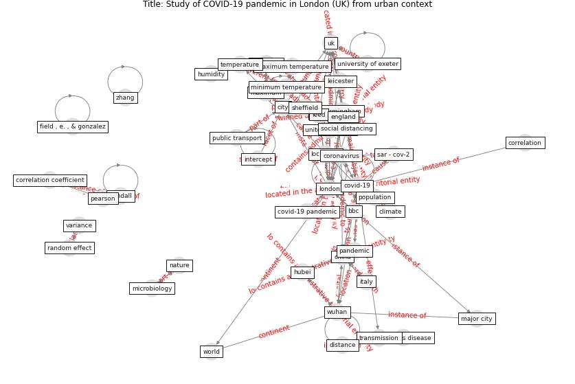

# Article: Study of COVID-19 pandemic in London (UK) from urban context (ghosh_study_2020)

* Source: [10.1016/j.cities.2020.102928](https://doi.org/10.1016/j.cities.2020.102928)
* Year: 2020
* Cluster: [city-health](cluster_14)

## Keywords

 * ac, as, bbc, birmingham, budapest, catalonia, cheng k, [china](keyword_china), [city](keyword_city), city level, [climate](keyword_climate), climate dependency, [coronavirus](keyword_coronavirus), coronavirus pandemic, correlation, cough, covid 19 infection, covid 19 outbreak, [covid 19 pandemic](keyword_covid_19_pandemic), covid 19 transmission, [covid-19](keyword_covid-19), dietz l, [disease](keyword_disease), doremalen, [droplet](keyword_droplet), effect, england, [europe](keyword_europe), ghosh a, global outbreak, gov, great london, [hubei](keyword_hubei), hubei province, [humidity](keyword_humidity), imperial, [india](keyword_india), [indonesia](keyword_indonesia), [infectious disease](keyword_infectious_disease), [influenza](keyword_influenza), intercept, ison s, [italy](keyword_italy), jakarta, jiang, jin, khan s, km, [leed](keyword_leed), leicester, [lockdown](keyword_lockdown), [london](keyword_london), mainland china, manchester, maximum, maximum temp, minha, minimum, minimum temperature, mode of transport, nazareth j, new case, nhs, northern ireland, norton b, norway, null hypothesis, nundy s, other four city, [pandemic](keyword_pandemic), pollock a, [population](keyword_population), [public transport](keyword_public_transport), roderick p, saksena, [sar cov 1](keyword_sar_cov_1), [sar cov 2](keyword_sar_cov_2), science, scotland, sheffield, siemen, slope, [social distancing](keyword_social_distancing), state in brazil, [temperature](keyword_temperature), ti, [time](keyword_time), [transmission](keyword_transmission), [unesco](keyword_unesco), [united kingdom](keyword_united_kingdom), [united states](keyword_united_states), university of exeter, [urban](keyword_urban), variance, wale, weather, who, [world heritage site](keyword_world_heritage_site), [wuhan](keyword_wuhan), xu

## Concepts

 

## Neighbours

### Closest articles

* Climate and the spread of COVID-19 - [LINK](article_chen_climate_2021)
* Effects of temperature and humidity on the spread of COVID-19: A systematic review - [LINK](article_mecenas_effects_2020)
* COVID-19 could be a seasonal illness with higher risk in winter: Reduced humidity linked to increased COVID-19 risk - [LINK](article_university_of_sydney_covid-19_2020)
* Mechanistic insights into the effect of humidity on airborne influenza virus survival, transmission and incidence - [LINK](article_marr_mechanistic_2019)
* A Mixed Approach on Resilience of Spanish Dwellings and Households during COVID-19 Lockdown - [LINK](article_cuerdo-vilches_mixed_2020)
* The impacts of knowledge, risk perception, emotion and information on citizens’ protective behaviors during the outbreak of COVID-19: a cross-sectional study in China - [LINK](article_ning_impacts_2020)
* Knowledge, attitudes, and practices of Indonesian residents regarding COVID-19: A national cross-sectional survey - [LINK](article_yodang_knowledge_2021)
* COVID-19 media fatigue: predictors of decreasing interest and avoidance of COVID-19–related news - [LINK](article_buneviciene_covid-19_2021)
* Questioning the use of the balcony in apartments during the COVID-19 pandemic process - [LINK](article_aydin_questioning_2020)
* The changes in the effects of social media use of Cypriots due to COVID-19 pandemic - [LINK](article_kaya_changes_2020)

### Closest BPs

* Blueprint: Public places as information points - [LINK](bp_8)
* Blueprint: Air Cleaning Plants - [LINK](bp_15)
* Blueprint: Tender support at building stage - [LINK](bp_9)
