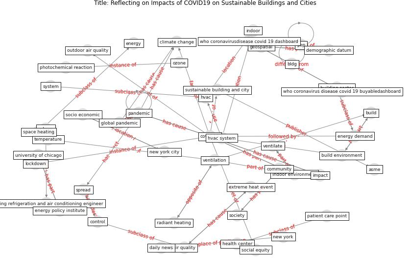

# Article: __Reflecting on Impacts of COVID19 on Sustainable Buildings and Cities__ (gonzalez_reflecting_2021)

* [10.1115/1.4050374](https://doi.org/10.1115/1.4050374)
* Cluster: [health-building](cluster_9)

## Keywords

* [pandemic](keyword_pandemic), [build](keyword_build), [new york](keyword_new_york), [ventilation](keyword_ventilation), [covid-19](keyword_covid-19), [new york city](keyword_new_york_city), [climate change](keyword_climate_change), covid19, [asme](keyword_asme), [building sector](keyword_building_sector), [build environment](keyword_build_environment), building system, indoor environment, radiant heating, sustainablebuilde

## Keywords at large

* [pandemic](keyword_pandemic), [build](keyword_build), [new york](keyword_new_york), [ventilation](keyword_ventilation), [covid-19](keyword_covid-19), [new york city](keyword_new_york_city), [bldg .](keyword_bldg_.), [climate change](keyword_climate_change), [asme](keyword_asme), [building sector](keyword_building_sector)

## Concepts

 

### Closest articles 

* [Assessment of Building Automation and Control Systems in Danish Healthcare Facilities in the COVID-19 Era](article_pedersen_assessment_2022)
* [Addressing the impact of COVID-19 lockdown on energy use in municipal buildings: A case study in Florianópolis, Brazil](article_geraldi_addressing_2021)
* [The effect of occupant distribution on energy consumption and COVID-19 infection in buildings: A case study of university building](article_mokhtari_effect_2021)
* [Impacts of COVID-19 on residential building energy use and performance](article_kawka_impacts_2021)
* [Occupants’ behavior and activity patterns influencing the energy consumption in the Kuwaiti residences](article_al-mumin_occupants_2003)
* [The effect of a redesigned floor plan, occupant density and the quality of indoor climate on the cost of space, productivity and sick leave in an office building–A case study](article_saari_effect_2006)
* [The Effect of Opening Windows on Air Change Rates in Two Homes](article_howard-reed_effect_2002)
* [Will a pandemic change building codes?](article_rozgus_will_2020)
* [Characterization and performance evaluation of a full-scale activated carbon-based dynamic botanical air filtration system for improving indoor air quality](article_wang_characterization_2011)
* [Architectural Design Drives the Biogeography of Indoor Bacterial Communities](article_kembel_architectural_2014)

