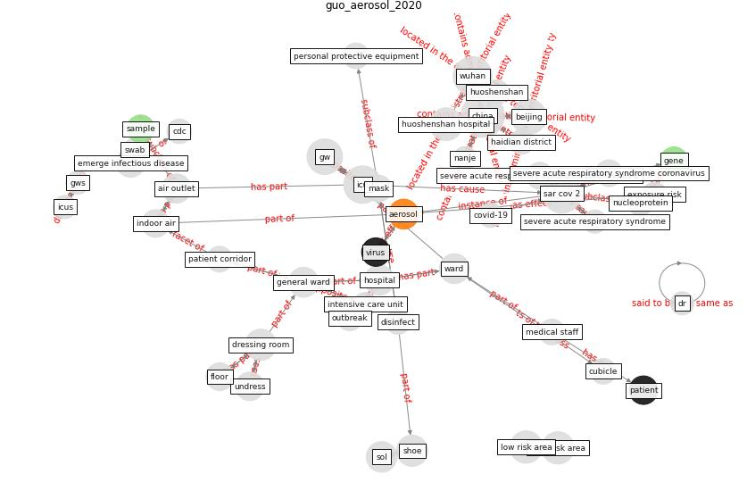

# Article: __Aerosol and Surface Distribution of Severe Acute Respiratory Syndrome Coronavirus 2 in Hospital Wards, Wuhan, China, 2020__ (guo_aerosol_2020)

* [10.3201/eid2607.200885](https://doi.org/10.3201/eid2607.200885)
* Cluster: [air-sars](cluster_2)

## Keywords

[aerosol](keyword_aerosol)

## Concepts

 

### References 

* [Air, Surface Environmental, and Personal
Protective Equipment Contamination by Severe
Acute Respiratory Syndrome Coronavirus 2
(SARS-CoV-2) From a Symptomatic Patient](article_ong_air_2020)

### Cited by 

* [Environmental factors involved in SARS-CoV-2
transmission: effect and role of indoor environmental
quality in the strategy for COVID-19 infection control](article_azuma_environmental_2020)
* [Upper-room ultraviolet air disinfection might help to
reduce COVID-19 transmission in buildings: a feasibility
study](article_beggs_upper-room_2020)
* [How can airborne transmission of COVID-19 indoors be
minimised?](article_morawska_how_2020)
* [COVID-19 Experience Transforming the Protective
Environment of Office Buildings and Spaces](article_phapant_covid-19_2021)
* [A Global Survey of Infection Control and
Mitigation Measures for Combating the Transmission
of COVID-19 Pandemic in Buildings Under
Facilities Management Services](article_sarvari_global_2022)
