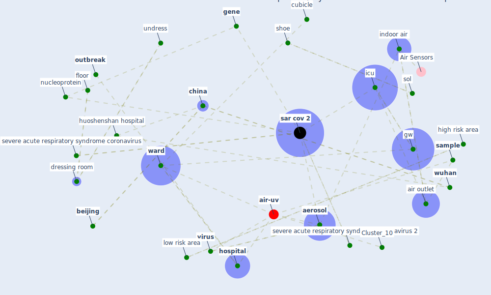

# Article: Aerosol and Surface Distribution of Severe Acute Respiratory Syndrome Coronavirus 2 in Hospital Wards, Wuhan, China, 2020 (guo_aerosol_2020)

* Source: [10.3201/eid2607.200885](https://doi.org/10.3201/eid2607.200885)
* Year: 2020
* Cluster: [air-sars](cluster_9)

## Keywords

 * 2014 ebola virus epidemic, academy of military science, [aerosol](keyword_aerosol), aerosol transmission, air flow, air outlet, [beijing](keyword_beijing), buffer room, cao, [cdc](keyword_cdc), [china](keyword_china), computer mouse, [corridor](keyword_corridor), [covid-19](keyword_covid-19), cubicle, [disease](keyword_disease), disinfect, dong, doorknob, dr, dressing room, egg, emerge infectious disease, epidemic in china, exposure risk, fece, floor, [gene](keyword_gene), glove, gravity, guo, [gw](keyword_gw), gws, haidian district, head, high risk, high risk area, home isolation, [hospital](keyword_hospital), huoshenshan, huoshenshan hospital, [icu](keyword_icu), icus, indoor air, infectious, jama, jamaica, low risk area, [manhattan](keyword_manhattan), [mask](keyword_mask), milder disease, nanje, nd nd nd nd nd nd nd nd nd nd, new york university, nucleic acid test, nucleoprotein, nucleoprotein gene, [outbreak](keyword_outbreak), partition, [patient](keyword_patient), patient care, patient corridor, patient room, [personal protective equipment](keyword_personal_protective_equipment), pharmacy, [room](keyword_room), [sample](keyword_sample), sampler, [sar cov 2](keyword_sar_cov_2), sar cov 2 transmission, sass 2300, severe acute respiratory syndrome, severe acute respiratory syndrome coronavirus, severe acute respiratory syndrome coronavirus 2, severe disease, shoe, sickbe, sierra leone, site 1, sleeve cuff, sol, swab, swab sample, tianjin, [toilet](keyword_toilet), [transmission](keyword_transmission), [treatment](keyword_treatment), undress, [virus](keyword_virus), [ward](keyword_ward), [wuhan](keyword_wuhan), wuhan huoshenshan hospital, x y, xia, xue, y w, z y, zhang, zhi, zhonghua yu fang yi xue

## Concepts

 

## Neighbours

### Closest articles

* Toilets dominate environmental detection of SARS-CoV-2 virus in a hospital - [LINK](article_ding_toilets_2020)
* Air, Surface Environmental, and Personal Protective Equipment Contamination by Severe Acute Respiratory Syndrome Coronavirus 2 (SARS-CoV-2) From a Symptomatic Patient - [LINK](article_ong_air_2020)
* SARS-CoV-2 RNA detection of hospital isolation wards hygiene monitoring during the Coronavirus Disease 2019 outbreak in a Chinese hospital - [LINK](article_wang_sars-cov-2_2020)
* Rapid expansion of temporary, reliable airborne-infection isolation rooms with negative air machines for critical COVID-19 patients - [LINK](article_lee_rapid_2020)
* COVID-19 Forced Hospitals to Build Negative Pressure Rooms Fast - [LINK](article_dyer_covid-19_2020)
* COVID-19 and its Modes of Transmission - [LINK](article_karia_covid-19_2020)
* COVID-19 Pandemic: Prevention and Protection Measures to Be Adopted at the Workplace - [LINK](article_cirrincione_covid-19_2020)
* COVID-19: Risk assessment and mitigation measures in healthcare and non-healthcare workplaces - [LINK](article_fawzy_covid-19_2021)
* Current knowledge of COVID-19: Advances, challenges and future perspectives - [LINK](article_wu_current_2021)
* COVID-19 Prevention and Control Measures in Workplace Settings: A Rapid Review and Meta-Analysis - [LINK](article_ingram_covid-19_2021)

### Closest BPs

* Blueprint: Negative pressure rooms - [LINK](bp_13)
* Blueprint: Installing high-efficiency air filters - [LINK](bp_11)
* Blueprint: Installing UV in ductwork - [LINK](bp_10)
