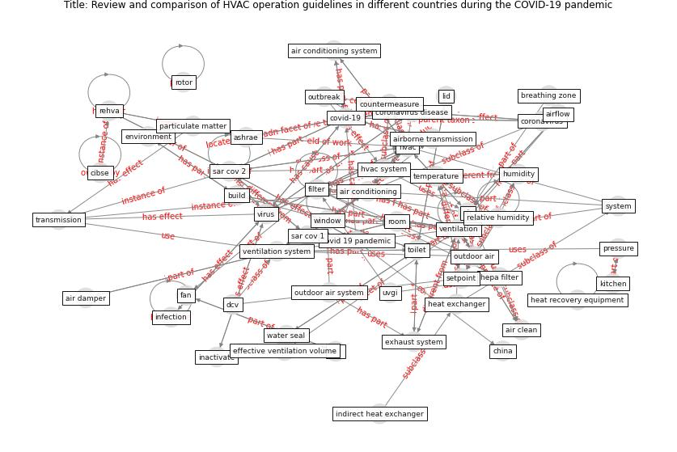

# Article: __Review and comparison of HVAC operation guidelines in different countries during the COVID-19 pandemic__ (guo_review_2021)

* [10.1016/j.buildenv.2020.107368](https://doi.org/10.1016/j.buildenv.2020.107368)
* Cluster: [air-sars](cluster_2)

## Keywords

* [ventilation](keyword_ventilation), [hvac](keyword_hvac), [sar cov 2](keyword_sar_cov_2), [covid-19](keyword_covid-19), [virus](keyword_virus), [air conditioning](keyword_air_conditioning), [toilet](keyword_toilet), [filter](keyword_filter), [temperature](keyword_temperature), [build](keyword_build), [ashrae](keyword_ashrae), [transmission](keyword_transmission), [relative humidity](keyword_relative_humidity), [ventilation system](keyword_ventilation_system), [air](keyword_air)

## Keywords at large

* [biophilic design](keyword_biophilic_design), [architecture](keyword_architecture), [sustainable architecture](keyword_sustainable_architecture), [nature](keyword_nature), [design](keyword_design), [biophilic](keyword_biophilic), [environ](keyword_environ), [biophilia](keyword_biophilia), [wellbeing](keyword_wellbeing), [health](keyword_health)

## Concepts

 

### References 

* [Aerosol and Surface Stability of SARS-CoV-2 as
Compared with SARS-CoV-1](article_van_doremalen_aerosol_2020)
* [How can airborne transmission of COVID-19 indoors be
minimised?](article_morawska_how_2020)

### Cited by 

* [Prophylactic Architecture: Formulating the Concept
of Pandemic-Resilient Homes](article_elrayies_prophylactic_2022)
* [A critical review of heating, ventilation, and air
conditioning (HVAC) systems within the context of a
global SARS-CoV-2 epidemic](article_elsaid_critical_2021)
* [Assessment of COVID-19 precautionary measures in sports
facilities: A case study on a health club in Saudi
Arabia](article_ibrahim_assessment_2022)
* [Designing Post COVID-19 Buildings: Approaches for
Achieving Healthy Buildings](article_navaratnam_designing_2022)
* [Impact of COVID-19 on IoT Adoption in Healthcare,
Smart Homes, Smart Buildings, Smart Cities,
Transportation and Industrial IoT](article_umair_impact_2021)
* [A review of facilities management interventions to
mitigate respiratory infections in existing buildings](article_zhang_review_2022)
