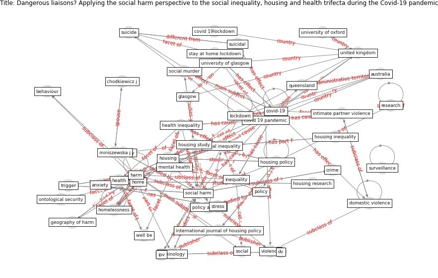

# Article: __Dangerous liaisons? Applying the social harm perspective to the social inequality, housing and health trifecta during the Covid-19 pandemic__ (gurney_dangerous_2021)

* [10.1080/19491247.2021.1971033](https://doi.org/10.1080/19491247.2021.1971033)
* Cluster: [health-building](cluster_9)

## Keywords

* [housing](keyword_housing), [social harm](keyword_social_harm), [covid-19 pandemic](keyword_covid-19_pandemic), [housing policy](keyword_housing_policy), [social inequality](keyword_social_inequality), [covid-19](keyword_covid-19), [lockdown](keyword_lockdown), [public health](keyword_public_health), [mental health](keyword_mental_health), [home](keyword_home), [harm](keyword_harm), [health](keyword_health), health inequality, housing study, [anxiety](keyword_anxiety)

## Keywords at large

* [housing](keyword_housing), [social harm](keyword_social_harm), [lockdown](keyword_lockdown), [covid-19 pandemic](keyword_covid-19_pandemic), [housing policy](keyword_housing_policy), [social inequality](keyword_social_inequality), [covid-19](keyword_covid-19), [harm](keyword_harm), [public health](keyword_public_health), [mental health](keyword_mental_health)

## Concepts

 

### Closest articles 

* [Eviction, Health Inequity, and the Spread of COVID-19: Housing Policy as a Primary Pandemic Mitigation Strategy](article_benfer_eviction_2021)
* [Housing Experience in Gated Communities in the Time of Pandemics: Lessons Learned from COVID-19](article_asfour_housing_2022)
* [A Mixed Approach on Resilience of Spanish Dwellings and Households during COVID-19 Lockdown](article_cuerdo-vilches_mixed_2020)
* [COVID-19 and social inequalities: a complex and dynamic interaction](article_quantin_covid-19_2022)
* [Mental health economics: A prospective study on psychological flourishing and associations with healthcare costs and sickness benefit transfers in Denmark](article_santini_mental_2021)
* [How Covid-19 Has Permanently Changed the Fitness
Industry](article_davalos_how_2021)
* [Questioning the use of the balcony in apartments during the COVID-19 pandemic process](article_aydin_questioning_2020)
* [Mental health and COVID-19](article_who_mental_2021)
* [Mental Health and the Covid-19 Pandemic](article_pfefferbaum_mental_2020)
* [How loneliness is talked about in social media during COVID-19 pandemic: Text mining of 4,492 Twitter feeds](article_koh_how_2022)

### References 

* [COVID-19 and the rise of intimate partner violence](article_aguero_covid-19_2021)
* [Eviction, Health Inequity, and the Spread of
COVID-19: Housing Policy as a Primary Pandemic
Mitigation Strategy](article_benfer_eviction_2021)
* [Home garden use during COVID-19: Associations with
physical and mental wellbeing in older adults](article_corley_home_2021)
* [Public housing and COVID-19: contestation, challenge and
change](article_power_public_2020)

### Cited by 

* [Making and unmaking home in the COVID-19 pandemic: a
qualitative research study of the experience of private
rental tenants in Ireland](article_byrne_making_2022)
