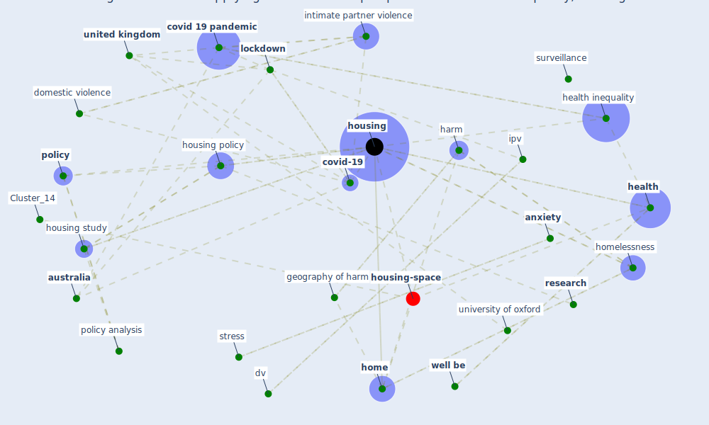

# Article: Dangerous liaisons? Applying the social harm perspective to the social inequality, housing and health trifecta during the Covid-19 pandemic (gurney_dangerous_2021)

* Source: [10.1080/19491247.2021.1971033](https://doi.org/10.1080/19491247.2021.1971033)
* Year: 2021
* Cluster: [space-housing](cluster_4)

## Keywords

 * abuser, [anxiety](keyword_anxiety), [australia](keyword_australia), behaviour, blakely t, building regulation, centre for collaborative housing evidence, chodkiewicz j, chung d, corley j, covid 19 lockdown, [covid 19 pandemic](keyword_covid_19_pandemic), covid 19lockdown, [covid-19](keyword_covid-19), crime, database, domestic abuse, domestic violence, dv, egregiouslyreporte, ellaway a, england, [epidemic](keyword_epidemic), european psychiatry, [fiorillo](keyword_fiorillo), geography of harm, glasgow, gosangi, grenfell tower, [harm](keyword_harm), [health](keyword_health), health inequality, health outcome, hiscock r, hmso, [home](keyword_home), [homelessness](keyword_homelessness), [housing](keyword_housing), housing policy, housing policy analysis, housing research, housing study, hubbard p, humphrey l, inequality, intimate partner violence, ipv, [italy](keyword_italy), kearn a, kumari m, kõlve k, least develop, literature review, [lockdown](keyword_lockdown), lynch j, m gurney, miniszewska j, naughton f, ncd, okely j, out of harm s way, perpetrator, pluto press, [poland](keyword_poland), [policy](keyword_policy), policy analysis, policy press, press, privatise, [public health](keyword_public_health), public health emergency, queensland, [research](keyword_research), [russia](keyword_russia), sampogna, scotland, sidana, [social](keyword_social), st petersburg, stay at home lockdown, [stress](keyword_stress), suicidal, suicide, [surveillance](keyword_surveillance), systematic review, the guardian, uk centre for collaborative housing evidence, [united kingdom](keyword_united_kingdom), university of oxford, unwin hyman, victim, violence, walklate s, ward e, weerakoon, [well be](keyword_well_be), what be not, what be significant, zemiology, zufferey c

## Concepts

 

## Neighbours

### Closest articles

* Public housing and COVID-19: contestation, challenge and change - [LINK](article_power_public_2020)
* Eviction, Health Inequity, and the Spread of COVID-19: Housing Policy as a Primary Pandemic Mitigation Strategy - [LINK](article_benfer_eviction_2021)
* Housing Experience in Gated Communities in the Time of Pandemics: Lessons Learned from COVID-19 - [LINK](article_asfour_housing_2022)
* Urban Community Sustainable Development Patterns under the Influence of COVID-19: A Case Study Based on the Non-Contact Interaction Perspective of Hangzhou City - [LINK](article_wang_urban_2021)
* The City Under COVID‐19: Podcasting As Digital Methodology - [LINK](article_rogers_city_2020)
* A Mixed Approach on Resilience of Spanish Dwellings and Households during COVID-19 Lockdown - [LINK](article_cuerdo-vilches_mixed_2020)
* Understanding the role of urban design in disease spreading - [LINK](article_brizuela_understanding_2019)
* Questioning the use of the balcony in apartments during the COVID-19 pandemic process - [LINK](article_aydin_questioning_2020)
* Urban design attributes and resilience: COVID-19 evidence from New York City - [LINK](article_yang_urban_2021)

### Closest BPs

* Blueprint: Resilience in staffing and skills training - [LINK](bp_12)
* Blueprint: Monitoring of wastewater - [LINK](bp_21)
* Blueprint: Installing high-efficiency air filters - [LINK](bp_11)
