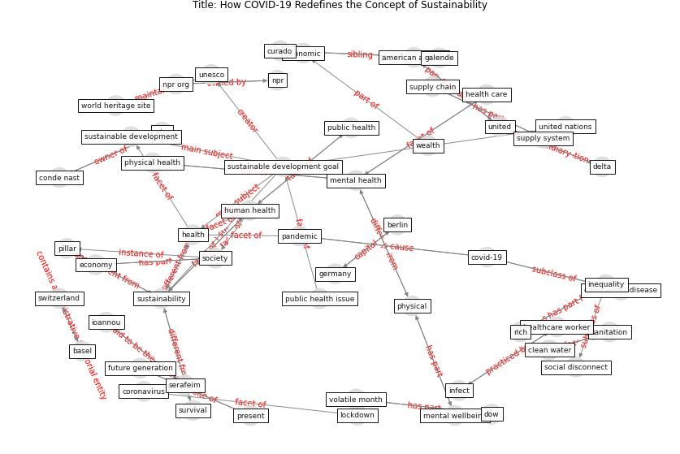

# Article: __How COVID-19 Redefines the Concept of Sustainability__ (hakovirta_how_2020)

* [10.3390/su12093727](https://doi.org/10.3390/su12093727)
* Cluster: [health-city](cluster_3)

## Keywords

[sustainability](keyword_sustainability), [health](keyword_health)

## Abstract

In January 2020, the World Health Organization (WHO)
declared the outbreak of a new coronavirus disease,
COVID-19, to be a public health emergency of international
concern. Currently, in several countries globally, this
pandemic continues to enforce the temporary closure of all
nonessential shops and services aside from supermarkets and
pharmacies. Workers in countries that are at a high risk of
infection have been asked to work from home, as cities have
been placed under lockdown. Even curfews to combat the
spread of the virus have been imposed in several countries,
with all this signaling an unprecedented disruption of
commerce. Companies are facing various challenges regarding
health and safety, supply chain, labor force, cash flow,
consumer demand and marketing. People in the thousands are
dying every day from the virus’s symptoms, while a public
health issue has forced the world to come to a halt and
rethink what a sustainable future for our planet and
existence is. These drastic recent events have raised the
deliberation by the authors to redefine the concept of
sustainability.

## Concepts

 

### References 

* [Mental Health and the Covid-19 Pandemic](article_pfefferbaum_mental_2020)

### Cited by 

* [Antivirus-built environment: Lessons learned from
Covid-19 pandemic](article_megahed_antivirus-built_2020)
* [Mapping research in logistics and supply chain management
during COVID-19 pandemic](article_montoya-torres_mapping_2021)
