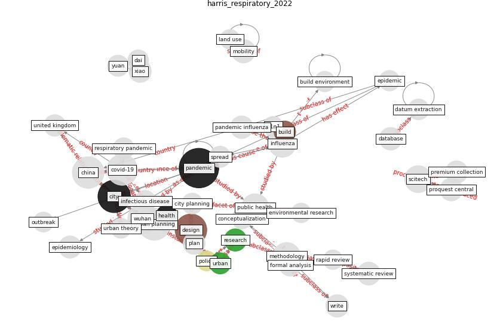

# Article: __Respiratory pandemics, urban planning and design: A multidisciplinary rapid review of the literature__ (harris_respiratory_2022)

* [10.1016/j.cities.2022.103767](https://doi.org/10.1016/j.cities.2022.103767)
* Cluster: [city-smart](cluster_10)

## Keywords

* [pandemic](keyword_pandemic), [city](keyword_city), [urban planning](keyword_urban_planning), [design](keyword_design), [covid-19](keyword_covid-19), [china](keyword_china), [wuhan](keyword_wuhan), [influenza](keyword_influenza), [scitech](keyword_scitech), [public health](keyword_public_health), methodology, scopus, [systematic review](keyword_systematic_review), pandemic influenza, database

## Keywords at large

* [pandemic](keyword_pandemic), [city](keyword_city), [urban planning](keyword_urban_planning), [design](keyword_design), [covid-19](keyword_covid-19), [china](keyword_china), [wuhan](keyword_wuhan), [influenza](keyword_influenza), [scitech](keyword_scitech), [public health](keyword_public_health)

## Abstract

COVID-19 is the most recent respiratory pandemic to
necessitate better knowledge about city planning and
design. The complex connections between cities and
pandemics, however challenge traditional approaches to
reviewing literature. In this article we adopted a rapid
review methodology. We review the historical literature on
respiratory pandemics and their documented connections to
urban planning and design (both broadly defined as being
concerned with cities as complex systems). Our systematic
search across multidisciplinary databases returned a total
of 1323 sources, with 92 articles included in the final
review. Findings showed that the literature represents the
multi-scalar nature of cities and pandemics – pandemics
are global phenomena spread through an interconnected
world, but require regional, city, local and individual
responses. We characterise the literature under ten themes:
scale (global to local); built environment; governance;
modelling; non-pharmaceutical interventions; socioeconomic
factors; system preparedness; system responses; underserved
and vulnerable populations; and future-proofing urban
planning and design. We conclude that the historical
literature captures how city planning and design intersects
with a public health response to respiratory pandemics. Our
thematic framework provides parameters for future research
and policy responses to the varied connections between
cities and respiratory pandemics.

## Concepts

 

### Closest articles 

* [COVID-19 Pandemic: Rethinking Strategies for
Resilient Urban Design, Perceptions, and
Planning](article_afrin_covid-19_2021)
* [The COVID-19 pandemic: Impacts on cities and major lessons for urban planning, design, and management](article_sharifi_covid-19_2020)
* [Epidemics, Planning and the City: A Special Issue of Planning Perspectives](article_davis_epidemics_2022)
* [Coronavirus questions that will not go away: interrogating urban and socio-spatial implications of COVID-19 measures](article_salama_coronavirus_2020)
* [COVID-19: Lessons for an Urban(izing) World](article_acuto_covid-19_2020)
* [Learning from pandemics: Applying resilience thinking to identify priorities for planning urban settlements](article_syal_learning_2021)
* [Pandemic stricken cities on lockdown. Where are our planning and design professionals [now, then and into the future]?](article_allam_pandemic_2020)
* [Antivirus-built environment: Lessons learned from Covid-19 pandemic](article_megahed_antivirus-built_2020)
* [WHO-2019-nCoV-Urban_preparedness-2020.1-eng](article_WHO-2019-nCoV-Urban_preparedness-2020.1-eng)
* [On the Coronavirus (COVID-19) Outbreak and the Smart City Network: Universal Data Sharing Standards Coupled with Artificial Intelligence (AI) to Benefit Urban Health Monitoring and Management](article_allam_coronavirus_2020)

### References 

* [Pandemic stricken cities on lockdown. Where are our
planning and design professionals [now, then and into the
future]?](article_allam_pandemic_2020)
* [Physical interventions to interrupt or reduce the spread
of respiratory viruses: systematic review](article_jefferson_physical_2008)
* [The COVID-19 pandemic: Impacts on cities and major
lessons for urban planning, design, and management](article_sharifi_covid-19_2020)
* [An investigation of transmission control measures during
the first 50 days of the COVID-19 epidemic in China](article_tian_investigation_2020)

### Cited by 

