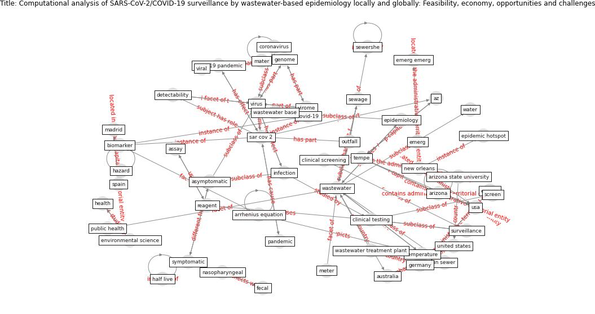

# Article: __Computational analysis of SARS-CoV-2/COVID-19 surveillance by wastewater-based epidemiology locally and globally: Feasibility, economy, opportunities and challenges__ (hart_computational_2020)

* [10.1016/j.scitotenv.2020.138875](https://doi.org/10.1016/j.scitotenv.2020.138875)
* Cluster: [wastewater-sars](cluster_12)

## Keywords

* [wastewater](keyword_wastewater), [virus](keyword_virus), [tempe](keyword_tempe), [epidemiology](keyword_epidemiology), halden, [environ](keyword_environ), [genome](keyword_genome), [sar cov 2](keyword_sar_cov_2), [wastewater treatment plant](keyword_wastewater_treatment_plant), science of the total environment, [model](keyword_model), [temperature](keyword_temperature), az, usa, [infection](keyword_infection)

## Keywords at large

* [biophilic design](keyword_biophilic_design), [architecture](keyword_architecture), [sustainable architecture](keyword_sustainable_architecture), [nature](keyword_nature), [design](keyword_design), [biophilic](keyword_biophilic), [environ](keyword_environ), [biophilia](keyword_biophilia), [wellbeing](keyword_wellbeing), [health](keyword_health)

## Concepts

 

