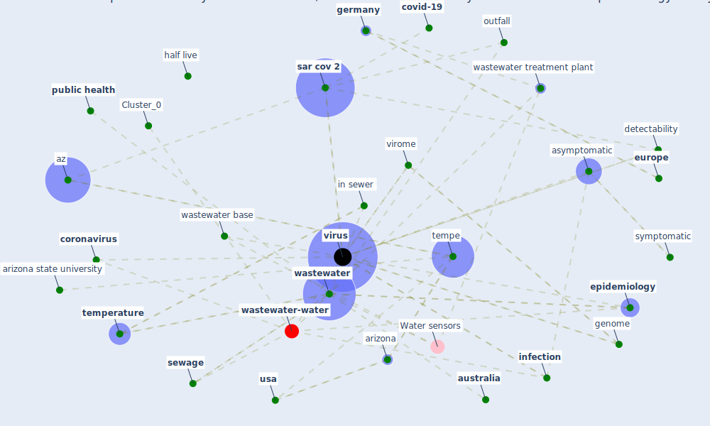

# Article: Computational analysis of SARS-CoV-2/COVID-19 surveillance by wastewater-based epidemiology locally and globally: Feasibility, economy, opportunities and challenges (hart_computational_2020)

* Source: [10.1016/j.scitotenv.2020.138875](https://doi.org/10.1016/j.scitotenv.2020.138875)
* Year: 2020
* Cluster: [wastewater-water](cluster_0)

## Keywords

 * I g h t s g r a p h, arizona, arizona state university, arrhenius equation, [assay](keyword_assay), asu, asymptomatic, [australia](keyword_australia), az, bi, [biomarker](keyword_biomarker), [city](keyword_city), clinically, collection system, consumption, confirme, [coronavirus](keyword_coronavirus), [covid 19 pandemic](keyword_covid_19_pandemic), [covid-19](keyword_covid-19), [datum](keyword_datum), detectability, dig, [digital](keyword_digital), e hart, emerg, emerg emerg, epidemic hotspot, [epidemiology](keyword_epidemiology), [europe](keyword_europe), european country, excretion, fecal, [genome](keyword_genome), [germany](keyword_germany), halden, half live, hazard, in sewer, [infection](keyword_infection), infective, insewer, intervention, infiltration, kathryn kauffman, latrine, leakage, level 2, livelihood, madrid, manhole, maricopa, [mater](keyword_mater), matrix, mayor, meng, meter, mexico, microbe, [microbiol](keyword_microbiol), [model](keyword_model), molecular, nasopharyngeal, new orleans, opioid, outfall, [pandemic](keyword_pandemic), [public health](keyword_public_health), reagent, rt pcr, s g r a p h, [sar cov 2](keyword_sar_cov_2), screen, season, serological, [sewage](keyword_sewage), sewage treatment plant, sewer, sewer network, sewershe, soil, [spain](keyword_spain), specific, steele, summer, symptomatic, [tempe](keyword_tempe), [temperature](keyword_temperature), transfer of heat, [united states](keyword_united_states), [usa](keyword_usa), varsani, [viral](keyword_viral), virome, [virus](keyword_virus), [wastewater](keyword_wastewater), wastewater base, wastewater treatment plant, [water](keyword_water), william hanage, [winter](keyword_winter)

## Concepts

 

## Neighbours

### Closest articles

* Future perspectives of wastewater-based epidemiology: Monitoring infectious disease spread and resistance to the community level - [LINK](article_sims_future_2020)
* An environmental and health perspective for COVID-19 outbreak: Meteorology and air quality influence, sewage epidemiology indicator, hospitals disinfection, drug therapies and recommendations - [LINK](article_barcelo_environmental_2020)
* When the fourth water and digital revolution encountered COVID-19 - [LINK](article_poch_when_2020)
* Designing a Multi-Agent Occupant Simulation System to Support Facility Planning and Analysis for COVID-19 - [LINK](article_lee_designing_2021)
* Ten questions concerning occupant health in buildings during normal operations and extreme events including the COVID-19 pandemic - [LINK](article_awada_ten_2021)
* Occupant health in buildings: Impact of the COVID-19 pandemic on the opinions of building professionals and implications on research - [LINK](article_awada_occupant_2022)
* Health, Wellbeing \& Productivity in Offices - [LINK](article_world_green_building_council_health_2014)

### Closest BPs

* Blueprint: Monitoring of wastewater - [LINK](bp_21)
* Blueprint: Indoor Environmental Quality (IEQ) monitoring system - [LINK](bp_3)
* Blueprint: Air Cleaning Plants - [LINK](bp_15)
