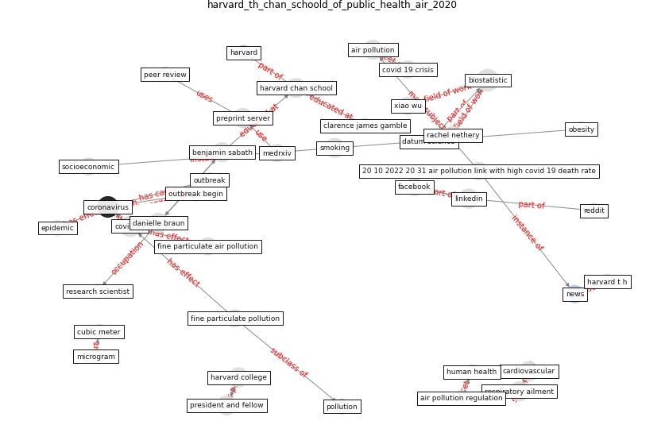

# Article: Air pollution linked with higher COVID-19 death rates (harvard_th_chan_schoold_of_public_health_air_2020)

* [https://www.hsph.harvard.edu/news/hsph-in-the-news/air-pollution-linked-with-higher-covid-19-death-rates/](https://www.hsph.harvard.edu/news/hsph-in-the-news/air-pollution-linked-with-higher-covid-19-death-rates/)
* Year: 2020
* Cluster: [health-patient](cluster_14)

## Keywords

 * [air pollution](keyword_air_pollution), air pollution regulation, [benjamin sabath](keyword_benjamin_sabath), [biostatistic](keyword_biostatistic), cardiovascular, clarence james gamble, [coronavirus](keyword_coronavirus), [covid 19 crisis](keyword_covid_19_crisis), [covid-19](keyword_covid-19), cubic meter, danielle braun, datum science, [epidemic](keyword_epidemic), [facebook](keyword_facebook), fine particulate air pollution, fine particulate pollution, harvard chan school, [harvard college](keyword_harvard_college), harvard t h, [human health](keyword_human_health), linkedin, microgram, [news](keyword_news), [obesity](keyword_obesity), [outbreak](keyword_outbreak), outbreak begin, pollution, president and fellow, rachel nethery, reddit, research scientist, respiratory ailment, smoking, socioeconomic, xiao wu

## Concepts

 

## Neighbours

### Closest articles

* COVID-19 Higher Mortality in Chinese Regions With Chronic Exposure to Lower Air Quality - [LINK](article_pansini_covid-19_2021)
* Nurture to nature via COVID-19, a self-regenerating environmental strategy of environment in global context - [LINK](article_paital_nurture_2020)
* Indirect effects of COVID-19 on the environment - [LINK](article_zambrano-monserrate_indirect_2020)
* The COVID-19 Impact on Flexible Office Space - [LINK](article_clifton_covid-19_2020)
* What our response to the COVID-19 pandemic tells us of our capacity to respond to climate change - [LINK](article_gemenne_what_2020)
* Coronavirus and Climate Change - [LINK](article_harvard_th_chan_schoold_of_public_health_coronavirus_2020)
* COVID-19 and its Modes of Transmission - [LINK](article_karia_covid-19_2020)
* Responsible Transport: A post-COVID agenda for transport policy and practice - [LINK](article_budd_responsible_2020)
* Mobility Behaviour in View of the Impact of the COVID-19 Pandemic—Public Transport Users in Gdansk Case Study - [LINK](article_przybylowski_mobility_2021)

### Closest BPs

* Blueprint: Monitoring of wastewater - [LINK](bp_21)
* Blueprint: Installing UV in ductwork - [LINK](bp_10)
* Blueprint: Resilience in staffing and skills training - [LINK](bp_12)
