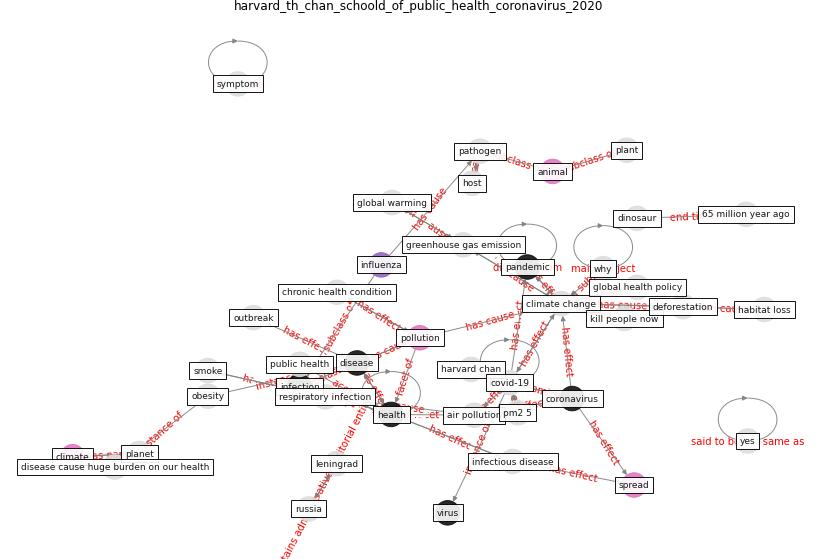

# Article: __Coronavirus and Climate Change__ (harvard_th_chan_schoold_of_public_health_coronavirus_2020)

* URL: [https://www.hsph.harvard.edu/c-change/subtopics/coronavirus-and-climate-change/](https://www.hsph.harvard.edu/c-change/subtopics/coronavirus-and-climate-change/)
* Year: 2020
* Abstract: Climate solutions are pandemic solutions.

## Keywords

[coronavirus](keyword_coronavirus), [health](keyword_health), [harvard](keyword_harvard), [disease](keyword_disease), [pandemic](keyword_pandemic), [animal](keyword_animal), [pollution](keyword_pollution)

## Concepts

 

