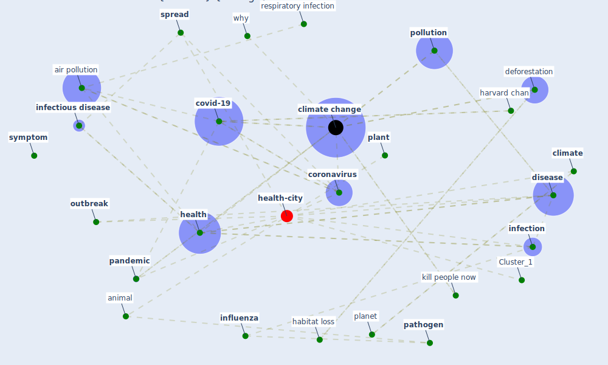

# Article: Coronavirus and Climate Change (harvard_th_chan_schoold_of_public_health_coronavirus_2020)

* [https://www.hsph.harvard.edu/c-change/subtopics/coronavirus-and-climate-change/](https://www.hsph.harvard.edu/c-change/subtopics/coronavirus-and-climate-change/)
* Year: 2020
* Cluster: [air-sars](cluster_9)

## Keywords

 * 2015 avian influenza, 65 million year ago, I didn t cause this, action, agricultural, [air pollutant](keyword_air_pollutant), [air pollution](keyword_air_pollution), animal, armageddon, bat, biodiversity crisis, button, cause this, [child](keyword_child), chronic health condition, [climate](keyword_climate), climate action, [climate change](keyword_climate_change), climate related crisis, climate resilient, coal, combat, contact, [coronavirus](keyword_coronavirus), [covid-19](keyword_covid-19), deforestation, [diabete](keyword_diabete), dinosaur, [disease](keyword_disease), disease cause huge burden on our health, earth, [economy](keyword_economy), emerge infectious disease, emerge infectious disease on the rise, [environment](keyword_environment), extreme event, family, fix, [fossil fuel](keyword_fossil_fuel), germ, go, greenhouse gas emission, grow crop, habitat loss, harvard chan, [health](keyword_health), [health care](keyword_health_care), health official, heart disease, heat, heat wave, host, hygiene, [infection](keyword_infection), [infectious disease](keyword_infectious_disease), [influenza](keyword_influenza), [influenza virus](keyword_influenza_virus), kill people now, kraków, leningrad, life on earth, next pandemic, [obesity](keyword_obesity), [outbreak](keyword_outbreak), [pandemic](keyword_pandemic), [pathogen](keyword_pathogen), planet, [plant](keyword_plant), pm2 5, pneumonia, [poland](keyword_poland), pollution, [prevention](keyword_prevention), [public health](keyword_public_health), public health expert, [research](keyword_research), respiratory infection, [russia](keyword_russia), science, share germ, slow motion, smoke, smoking, sneeze, specie, [spread](keyword_spread), [symptom](keyword_symptom), [transmission](keyword_transmission), transmission of coronavirus, trend, [united states](keyword_united_states), university of pennsylvania, vibrio parahaemolyticus, [virus](keyword_virus), warm weather, wharton school, why, wild animal, wildfire, xiauo wu

## Concepts

 

## Neighbours

### Closest articles

* What our response to the COVID-19 pandemic tells us of our capacity to respond to climate change - [LINK](article_gemenne_what_2020)
* COVID-19 risks and systemic gaps in Nigeria: resilience building lessons for pandemic and climate change management - [LINK](article_lawal_covid-19_2022)
* Navigating Climate Change: Rethinking the Role of Buildings - [LINK](article_cole_navigating_2020)
* Responsible Transport: A post-COVID agenda for transport policy and practice - [LINK](article_budd_responsible_2020)
* Mobility Behaviour in View of the Impact of the COVID-19 Pandemic—Public Transport Users in Gdansk Case Study - [LINK](article_przybylowski_mobility_2021)
*  - [LINK](article_yakubu_aminu_dodo_green_2020)
* The Smart City and Covid‐19 - [LINK](article_webb_smart_2020)
* Revisiting the built environment: 10 potential development changes and paradigm shifts due to COVID-19 - [LINK](article_cheshmehzangi_revisiting_2021)
* The three modes of existence of the pandemic smart city - [LINK](article_soderstrom_three_2021)

### Closest BPs

* Blueprint: Smart Locker System - [LINK](bp_1)
* Blueprint: Mental health – Belong: Do something with someone - [LINK](bp_19)
* Blueprint: Mental health – Act: Do something - [LINK](bp_18)
