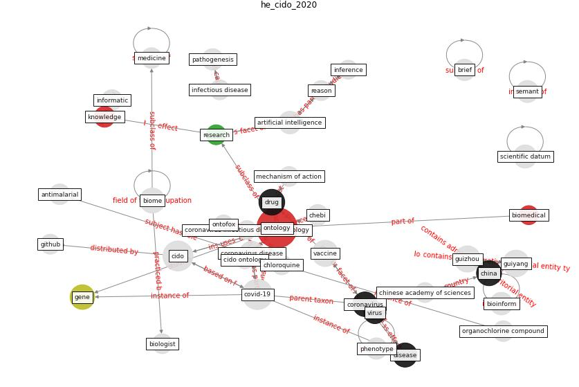

# Article: __CIDO, a community-based ontology for coronavirus disease knowledge and data integration, sharing, and analysis__ (he_cido_2020)

* [10.1038/s41597-020-0523-6](https://doi.org/10.1038/s41597-020-0523-6)
* Cluster: [ontology-datum](cluster_5)

## Keywords

[ontology](keyword_ontology), [drug](keyword_drug), [china](keyword_china), [coronavirus](keyword_coronavirus), [gene](keyword_gene), [disease](keyword_disease)

## Abstract

The Coronavirus Infectious Disease Ontology (CIDO) is a
community-based ontology that supports coronavirus disease
knowledge and data standardization, integration, sharing,
and analysis.

## Concepts

 

