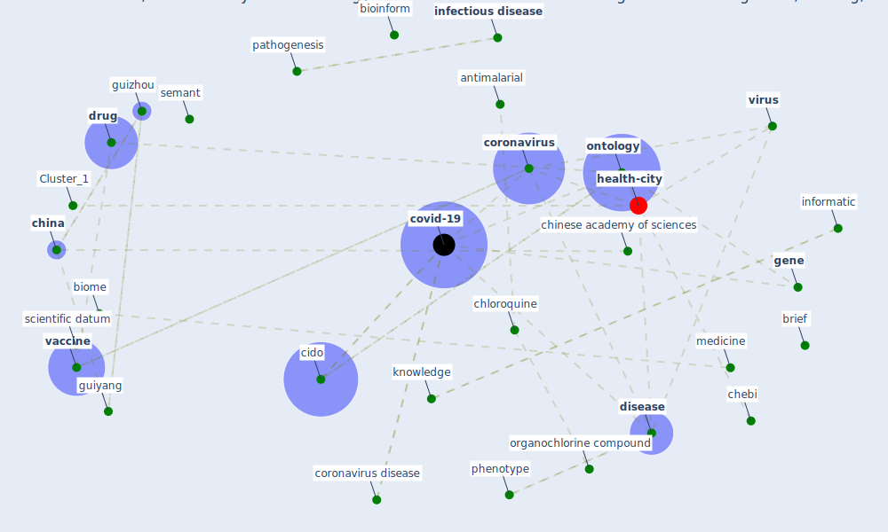

# Article: CIDO, a community-based ontology for coronavirus disease knowledge and data integration, sharing, and analysis (he_cido_2020)

* Source: [10.1038/s41597-020-0523-6](https://doi.org/10.1038/s41597-020-0523-6)
* Year: 2020
* Cluster: [ontology-datum](cluster_12)

## Keywords

 * abbreviate, [algorithm](keyword_algorithm), antagonist, antimalarial, beverley j, bioinform, bioinformatic, biologist, biome, [biomedical](keyword_biomedical), brief, chebi, [china](keyword_china), chinese academy of sciences, chloroquine, [cido](keyword_cido), cido ontology, class, computational, [coronavirus](keyword_coronavirus), coronavirus disease, coronavirus infectious disease ontology, coronavirus metadata ontology, [covid-19](keyword_covid-19), [datum](keyword_datum), [disease](keyword_disease), [drug](keyword_drug), etiology, extensible ontology development, five v s, four fairness principle, [gene](keyword_gene), gene marker, gene ontology, genet, [genome](keyword_genome), geo3, github, go, guiyang, [guizhou](keyword_guizhou), healthcare associate outbreak, hum, human phenotype ontology, [infection](keyword_infection), [infectious disease](keyword_infectious_disease), inference, informatic, inhibitor, [interoperability](keyword_interoperability), interoperable, j j thorac, [knowledge](keyword_knowledge), kunme, library ontology, life science, ljubljana, mechanism of action, medicine, middle east respiratory syndrome coronavirus, [nature](keyword_nature), ncbi taxonomy ontology, obo foundry, ontofox, ontologically, [ontology](keyword_ontology), ontology class, ontology interoperability, open community, organochlorine compound, p 7, pathogenesis, permission information, phenotype, [public health](keyword_public_health), reason, reprint, [research](keyword_research), reverse vaccinology, saccharomyce cerevisiae, scientific datum, scientificdata, semant, [semantic](keyword_semantic), [shanghai](keyword_shanghai), silos, [slovenia](keyword_slovenia), smith b, software application, stewardship, subbranche, taxonomy, therapeutic drug, thorac, [vaccine](keyword_vaccine), vaccine ontology, [virus](keyword_virus), vo, whetzel, yeast

## Concepts

 

## Neighbours

### Closest articles

* The COVID-19 epidemiology and monitoring ontology - [LINK](article_queralt-rosinach_covid-19_2021)
* An Overview of Ontologies and Tool Support for COVID-19 Analytics - [LINK](article_ahmad_overview_2021)
* An Overview of Biomedical Ontologies for Pandemics and Infectious Diseases Representation - [LINK](article_bayoudhi_overview_2021)
* Covid-19 and the politics of sustainable energy transitions - [LINK](article_kuzemko_covid-19_2020)
* Contextualizing the Covid-19 pandemic for a carbon-constrained world: Insights for sustainability transitions, energy justice, and research methodology - [LINK](article_sovacool_contextualizing_2020)
* How to Make Green Building Certification &amp; Rating Systems More Pandemic-Sustainable? - [LINK](article_ujikawa_how_2022)
* Assessment method for new sustainability indicators providing pandemic resilience for residential buildings - [LINK](article_tokazhanov_assessment_2021)
* Validity of energy social research during and after COVID-19: challenges, considerations, and responses - [LINK](article_fell_validity_2020)
* Readiness Assessment of Green Building Certification Systems for Residential Buildings during Pandemics - [LINK](article_tleuken_readiness_2021)
* Addressing the impact of COVID-19 lockdown on energy use in municipal buildings: A case study in Florianópolis, Brazil - [LINK](article_geraldi_addressing_2021)

### Closest BPs

* Blueprint: nan - [LINK](bp_34)
* Blueprint: Tender support at building stage - [LINK](bp_9)
* Blueprint: Building Adaptation during a pandemic - [LINK](bp_14)
