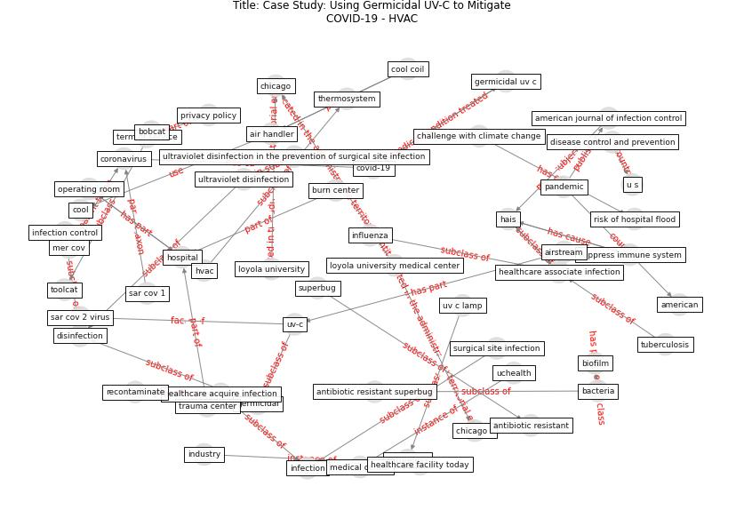

# Article: __Case Study: Using Germicidal UV-C to Mitigate COVID-19 - HVAC__ (healthcare_facilities_today_case_2021)

* URL: [https://www.healthcarefacilitiestoday.com/posts/Case-Study-Using-Germicidal-UV-C-to-Mitigate-COVID-19--26026](https://www.healthcarefacilitiestoday.com/posts/Case-Study-Using-Germicidal-UV-C-to-Mitigate-COVID-19--26026)
* Year: 2021

## Keywords

[coronavirus](keyword_coronavirus), [bacteria](keyword_bacteria), [germicidal](keyword_germicidal), [disinfection](keyword_disinfection)

## Concepts

 

