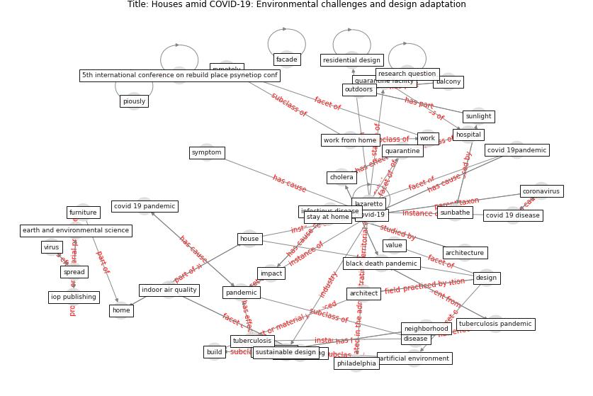

# Article: Houses amid COVID-19: Environmental challenges and design adaptation (hizra_houses_2021)

* Source: [10.1088/1755-1315/881/1/012033](https://doi.org/10.1088/1755-1315/881/1/012033)
* Year: 2021
* Cluster: [building-space](cluster_1)

## Keywords

 * 5th international conference on rebuild place psynetiop conf, [air](keyword_air), [airborne](keyword_airborne), [architect](keyword_architect), [architecture](keyword_architecture), artificial environment, [balcony](keyword_balcony), banda aceh, bathroom, black death, black death pandemic, bore, [build](keyword_build), [building](keyword_building), [cholera](keyword_cholera), cholera pandemic, [city](keyword_city), close, [coronavirus](keyword_coronavirus), covid 19 disease, [covid 19 pandemic](keyword_covid_19_pandemic), covid 19pandemic, [covid-19](keyword_covid-19), covid19 pandemic, cure, descriptive analysis, [design](keyword_design), digital era, digitalization, [disease](keyword_disease), [droplet](keyword_droplet), earth and environmental science, [environment](keyword_environment), exterior design, facade, furniture, globalization, heliyon, historical pandemic, [home](keyword_home), [hospital](keyword_hospital), [house](keyword_house), [housing](keyword_housing), [human](keyword_human), hygiene, [impact](keyword_impact), [indonesia](keyword_indonesia), [indoor air quality](keyword_indoor_air_quality), industrial revolution, infect, [infection](keyword_infection), [infectious disease](keyword_infectious_disease), interior design, iop publishing, lazaretto, [le corbusier](keyword_le_corbusier), [lockdown](keyword_lockdown), medical treatment, method, natural lighting, [neighborhood](keyword_neighborhood), ourhouse, outdoor access, outdoors, outside air, [pandemic](keyword_pandemic), pandemic and potential strategy, philadelphia, piously, [qualitative](keyword_qualitative), quarantine, quarantine facility, remotely, [research](keyword_research), research question, [residential](keyword_residential), residential design, sanitation, sink, [spread](keyword_spread), st paul s cathedral, stay at home, [study](keyword_study), sunbathe, sunlight, [surface](keyword_surface), sustainable design, [symptom](keyword_symptom), [technology](keyword_technology), [tuberculosis](keyword_tuberculosis), tuberculosis pandemic, understand, universitas syiah kuala, value, [ventilation](keyword_ventilation), [ventilation system](keyword_ventilation_system), villa savoye, [virus](keyword_virus), [work](keyword_work), work from home

## Concepts

 

## Neighbours

### Closest articles

* Adaptive Design of the Built Environment to Mitigate the Transmission Risk of COVID-19 - [LINK](article_ara_dilshad_shangi_adaptive_2020)
* RESIDENTIAL ARCHITECTURE IN A POST-PANDEMIC WORLD: IMPLICATIONS OF COVID-19 FOR NEW CONSTRUCTION AND FOR ADAPTING HERITAGE BUILDINGS - [LINK](article_spennemann_residential_2021)
* COVID-19 Lessons for a Resilient Built Environment: A Roadmap - [LINK](article_hull_covid-19_2020)
* Designing for COVID-2x: Reflecting on Future-Proofing Human Habitation for the Inevitable Next Pandemic - [LINK](article_spennemann_designing_2022)
* Antivirus-built environment: Lessons learned from Covid-19 pandemic - [LINK](article_megahed_antivirus-built_2020)
* How the Coronavirus Will Reshape Architecture - [LINK](article_chayka_how_2020)
* COVID-19 Could Leverage a Sustainable Built Environment - [LINK](article_pinheiro_covid-19_2020)
* How Architecture Fails in Conditions of Crisis: a Discussion on the Value of Interior Design over the COVID-19 Outbreak - [LINK](article_rassia_how_2020)
* Impact of Covid-19 on the built environment - [LINK](article_mahima_impact_2022)

### Closest BPs

* Blueprint: Architecture design - [LINK](bp_2)
* Blueprint: Building Adaptation during a pandemic - [LINK](bp_14)
* Blueprint: Tender support at building stage - [LINK](bp_9)
