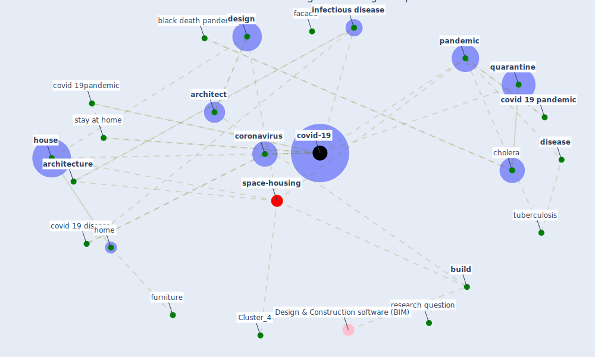

# Article: Houses amid COVID-19: Environmental challenges and design adaptation (hizra_houses_2021)

* Source: [10.1088/1755-1315/881/1/012033](https://doi.org/10.1088/1755-1315/881/1/012033)
* Year: 2021
* Cluster: [space-housing](cluster_4)

## Keywords

 * [air](keyword_air), [airborne](keyword_airborne), [architect](keyword_architect), [architecture](keyword_architecture), [balcony](keyword_balcony), banda aceh, bathroom, black death, black death pandemic, bore, [build](keyword_build), [building](keyword_building), [cholera](keyword_cholera), cholera pandemic, [city](keyword_city), close, [coronavirus](keyword_coronavirus), covid 19 disease, [covid 19 pandemic](keyword_covid_19_pandemic), covid 19pandemic, [covid-19](keyword_covid-19), cure, descriptive analysis, [design](keyword_design), digitalization, [disease](keyword_disease), [droplet](keyword_droplet), [environment](keyword_environment), exterior design, facade, furniture, globalization, [home](keyword_home), [hospital](keyword_hospital), [house](keyword_house), [housing](keyword_housing), housing characteristic, how the coronavirus will reshape architecture, hygiene, [impact](keyword_impact), [indonesia](keyword_indonesia), [indoor air quality](keyword_indoor_air_quality), [infect](keyword_infect), [infection](keyword_infection), [infectious](keyword_infectious), [infectious disease](keyword_infectious_disease), interior, interior design, [knowledge](keyword_knowledge), lazaretto, [le corbusier](keyword_le_corbusier), lifestyle, [lockdown](keyword_lockdown), [neighborhood](keyword_neighborhood), ourhouse, outdoor access, outdoors, outside air, [pandemic](keyword_pandemic), piously, process, [qualitative](keyword_qualitative), [quarantine](keyword_quarantine), quarantine building, quarantine facility, remotely, [research](keyword_research), research question, [sanitation](keyword_sanitation), shelter, sink, slide panel, [space](keyword_space), [spread](keyword_spread), st paul s cathedral, stay at home, [stress](keyword_stress), [study](keyword_study), sunbathe, [sunlight](keyword_sunlight), [surface](keyword_surface), [sustainable](keyword_sustainable), sustainable design, [symptom](keyword_symptom), [technology](keyword_technology), [transmission](keyword_transmission), [tuberculosis](keyword_tuberculosis), tuberculosis pandemic, understand, universitas syiah kuala, value, value of the house, venice, [ventilation](keyword_ventilation), ventilation system, villa savoye, [virus](keyword_virus), [water](keyword_water), [work](keyword_work), work from home

## Concepts

 

## Neighbours

### Closest articles

* Adaptive Design of the Built Environment to Mitigate the Transmission Risk of COVID-19 - [LINK](article_ara_dilshad_shangi_adaptive_2020)
* RESIDENTIAL ARCHITECTURE IN A POST-PANDEMIC WORLD: IMPLICATIONS OF COVID-19 FOR NEW CONSTRUCTION AND FOR ADAPTING HERITAGE BUILDINGS - [LINK](article_spennemann_residential_2021)
* Designing for COVID-2x: Reflecting on Future-Proofing Human Habitation for the Inevitable Next Pandemic - [LINK](article_spennemann_designing_2022)
* COVID-19 Lessons for a Resilient Built Environment: A Roadmap - [LINK](article_hull_covid-19_2020)
* How our homes impact our health: using a COVID-19 informed approach to examine urban apartment housing - [LINK](article_peters_how_2020)
* How Architecture Fails in Conditions of Crisis: a Discussion on the Value of Interior Design over the COVID-19 Outbreak - [LINK](article_rassia_how_2020)
* How the Coronavirus Will Reshape Architecture - [LINK](article_chayka_how_2020)
* Towards Resilient Residential Buildings and Neighborhoods in Light of COVID-19 Pandemic—The Scenario of Podgorica, Montenegro - [LINK](article_bojovic_towards_2022)
* Urban Community Sustainable Development Patterns under the Influence of COVID-19: A Case Study Based on the Non-Contact Interaction Perspective of Hangzhou City - [LINK](article_wang_urban_2021)

### Closest BPs

* Blueprint: Monitoring of wastewater - [LINK](bp_21)
* Blueprint: Air Cleaning Plants - [LINK](bp_15)
* Blueprint: Installing high-efficiency air filters - [LINK](bp_11)
