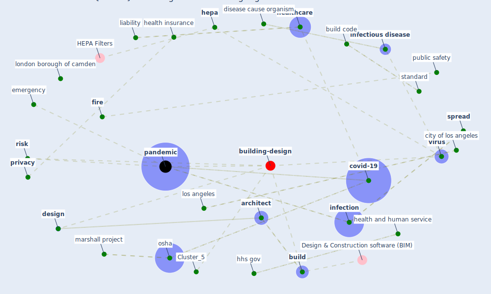

# Article: How will COVID-19 change future building regulations? (hmc_architects_how_2020)

* [https://61ccv1s4h9i2otvw249pcyxh-wpengine.netdna-ssl.com/wp-content/uploads/COVID19_CIVIC_Regulatory_Aug2020.pdf](https://61ccv1s4h9i2otvw249pcyxh-wpengine.netdna-ssl.com/wp-content/uploads/COVID19_CIVIC_Regulatory_Aug2020.pdf)
* Year: 2020
* Cluster: [air-sars](cluster_9)

## Keywords

 * [air](keyword_air), american, [architect](keyword_architect), [ashrae](keyword_ashrae), ashrae journal, [australia](keyword_australia), barrier separation, bathroom, bill, budgetary, [build](keyword_build), build code, [building](keyword_building), building regulation, building water system, [california](keyword_california), california building code, cap, [city](keyword_city), city of los angeles, [clean](keyword_clean), code, communicable disease, [covid-19](keyword_covid-19), [crisis](keyword_crisis), current, [design](keyword_design), disease cause organism, door handle, ductwork, emergency, emergency action plan, emergency response, emergencyplan, [engineering](keyword_engineering), [epidemic](keyword_epidemic), event, exhaust air, [filter](keyword_filter), fire, flame spread, frontline worker, future, good practice, health and human service, health information, health information privacy, health insurance, [healthcare](keyword_healthcare), hepa, hhs gov, high caution, [humidity](keyword_humidity), impact to society, [infection](keyword_infection), [infectious disease](keyword_infectious_disease), institutional, insurance, jail, legionellosis, legionnaire disease, liability, library, [lockdown](keyword_lockdown), london borough of camden, los angeles, lung inflammation, [manhattan](keyword_manhattan), marshall, marshall project, maxim, [new york city](keyword_new_york_city), [osha](keyword_osha), [outbreak](keyword_outbreak), [pandemic](keyword_pandemic), phase 3, pneumonia, prison, [privacy](keyword_privacy), public safety, reduce humidity, regulatory, require, rescue operation, [risk](keyword_risk), [room](keyword_room), sanitize, self fund mechanism, senate, sign and symptom, spray, [spread](keyword_spread), [standard](keyword_standard), strategy, supply air, twenty first century, united states house of representative, university of sydney, ventilation system, [virus](keyword_virus)

## Concepts

 

## Neighbours

### Closest articles

* Will a pandemic change building codes? - [LINK](article_rozgus_will_2020)
* The contribution of green buildings in the fight against COVID-19 - [LINK](article_world_green_building_council_contribution_2020)
* Smart buildings: how a virus might lead to healthier buildings - Arup - [LINK](article_lam_smart_2021)
* An Automated System to Limit COVID-19 Using Facial Mask Detection in Smart City Network - [LINK](article_rahman_automated_2020)
* Public housing and COVID-19: contestation, challenge and change - [LINK](article_power_public_2020)
* Towards the sustainable development of smart cities through mass video surveillance: A response to the COVID-19 pandemic - [LINK](article_shorfuzzaman_towards_2021)
*  - [LINK](article_huy-tran_design_2022)
* DeepSOCIAL: Social Distancing Monitoring and Infection Risk Assessment in COVID-19 Pandemic - [LINK](article_rezaei_deepsocial_2020)
* Dangerous liaisons? Applying the social harm perspective to the social inequality, housing and health trifecta during the Covid-19 pandemic - [LINK](article_gurney_dangerous_2021)
* Designing Post COVID-19 Buildings: Approaches for Achieving Healthy Buildings - [LINK](article_navaratnam_designing_2022)

### Closest BPs

* Blueprint: Tracking and enforcing use of Personal Protective Equipment - [LINK](bp_23)
* Blueprint: Architecture design - [LINK](bp_2)
* Blueprint: Building Adaptation during a pandemic - [LINK](bp_14)
