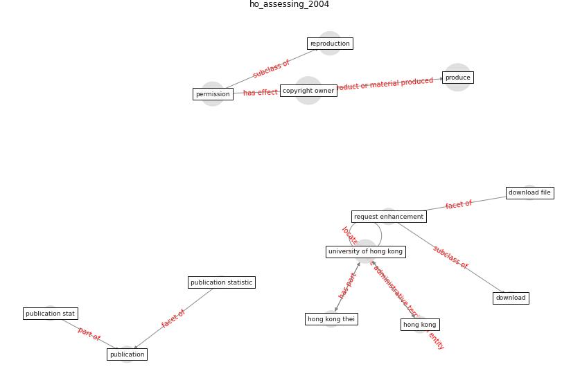

# Article: __Assessing the health and hygiene performance of apartment buildings__ (ho_assessing_2004)

* [10.1108/02632770410527789](https://doi.org/10.1108/02632770410527789)
* Cluster: [health-city](cluster_3)

## Keywords

[download](keyword_download)

## Abstract

The recent global outbreak of Severe Acute Respiratory
Syndrome has aroused public concern on environmental health
and hygiene. Develops a practical assessment scheme for
assessing the health and hygiene performance of apartment
buildings in Hong Kong. The scheme involves assessing a
hierarchy of building factors that have a bearing on
environmental qualities, and thus occupants’ health.
Proposes an index method to integrate the assessment
outcomes into a simple and user‐ friendly performance
indicator for public consumption. The index can inform the
public of the health and hygiene risk of different
buildings and facilitate building owners, developers, and
government bodies to make more informed and socially
responsible decisions on environmental health and hygiene
improvement. Although the assessment scheme is tailored for
the institutional and cultural settings of Hong Kong, the
assessment framework for the development of the scheme is
also applicable to other cities.

## Concepts

 

