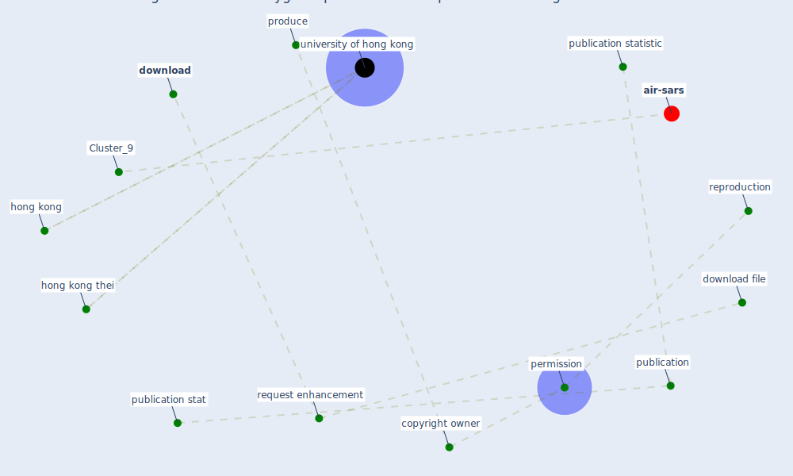

# Article: Assessing the health and hygiene performance of apartment buildings (ho_assessing_2004)

* Source: [10.1108/02632770410527789](https://doi.org/10.1108/02632770410527789)
* Year: 2004
* Cluster: [air-sars](cluster_9)

## Keywords

 * [copyright owner](keyword_copyright_owner), [download](keyword_download), download file, [hong kong](keyword_hong_kong), hong kong thei, [permission](keyword_permission), [produce](keyword_produce), publication, publication stat, publication statistic, [reproduction](keyword_reproduction), request enhancement, [university of hong kong](keyword_university_of_hong_kong)

## Concepts

 

## Neighbours

### Closest articles

* How Covid-19 Has Permanently Changed the Fitness Industry - [LINK](article_davalos_how_2021)
* A Platform for Citizen Cooperation during the COVID-19 Pandemic in RN, Brazil - [LINK](article_de_araujo_platform_2020)
* Reframe how to serve your community in the midst of a pandemic - [LINK](article_sutton_reframe_2020)
* COVID-19 Bulletin 1: Alterations to BREEAM assessment requirements as a result of the Coronavirus pandemic – Knowledge Base - [LINK](article_breeam_covid-19_2020)
* Attitudes towards outdoor and neighbour noise during the COVID-19 lockdown: A case study in London - [LINK](article_lee_attitudes_2021)
* How loneliness is talked about in social media during COVID-19 pandemic: Text mining of 4,492 Twitter feeds - [LINK](article_koh_how_2022)
* The City Under COVID‐19: Podcasting As Digital Methodology - [LINK](article_rogers_city_2020)
* Rotating groups at work, school best against COVID-19 spread: Study - [LINK](article_afp_rotating_2021)
* Assessment of COVID-19 precautionary measures in sports facilities: A case study on a health club in Saudi Arabia - [LINK](article_ibrahim_assessment_2022)
* Construction of a Linked Data Set of COVID-19 Knowledge Graphs: Development and Applications - [LINK](article_wang_construction_2022)

### Closest BPs

* Blueprint: Resilience in staffing and skills training - [LINK](bp_12)
* Blueprint: Tracking and enforcing use of Personal Protective Equipment - [LINK](bp_23)
* Blueprint: Public places as information points - [LINK](bp_8)
