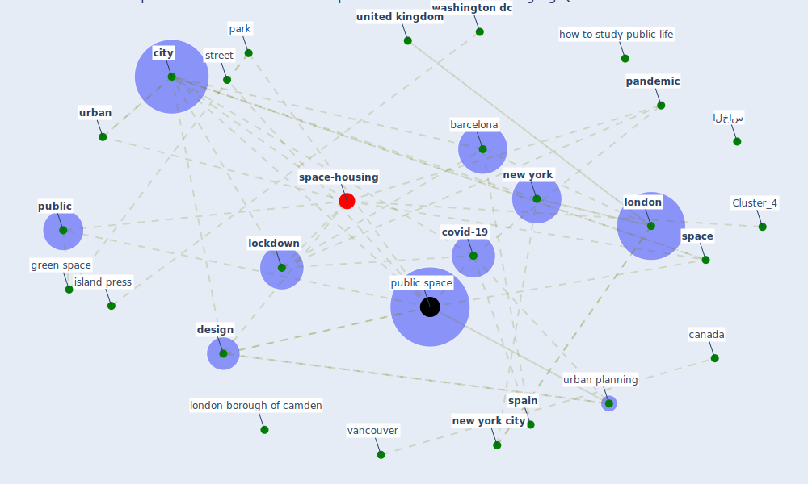

# Article: The Impact of COVID-19 on Public Space: A Review of the Emerging Questions (honey-roses_impact_2020)

* Source: [10.31219/osf.io/rf7xa](https://doi.org/10.31219/osf.io/rf7xa)
* Year: 2020
* Cluster: [space-housing](cluster_4)

## Keywords

 * active city, animal take back the world, [barcelona](keyword_barcelona), benefit of green roof, bogotá, [build](keyword_build), cambridge, cambridge university press, [canada](keyword_canada), chile, [china](keyword_china), [city](keyword_city), citylab, civil liberty, class, [corona](keyword_corona), [coronavirus](keyword_coronavirus), [covid 19 crisis](keyword_covid_19_crisis), [covid-19](keyword_covid-19), cyclist, [dataset](keyword_dataset), [design](keyword_design), document, [economy](keyword_economy), ecosystem service, ecumenopoli, eugene ionesco, eure, exclusion, [green space](keyword_green_space), green space planning, how to study public life, human in hiding, impossible, [india](keyword_india), inequity and exclusion, interior, island, island press, istanbul, jiangne district, josep bohigas, knowledge platform, ljubljana, [lockdown](keyword_lockdown), [london](keyword_london), london borough of camden, low income, [manhattan](keyword_manhattan), mexico, micro mobility, minority, nanje, neighbourhood, neurotransmitter, [new york](keyword_new_york), [new york city](keyword_new_york_city), nieuwenhuijsen, online shopping, orellana a, overton window, [pandemic](keyword_pandemic), park, [pedestrian](keyword_pedestrian), perception, [plan](keyword_plan), [policy](keyword_policy), [practice](keyword_practice), [public](keyword_public), [public health](keyword_public_health), [public space](keyword_public_space), quebec, [region](keyword_region), rooftop, [russia](keyword_russia), [shop](keyword_shop), sidewalk, [slovenia](keyword_slovenia), [social](keyword_social), [space](keyword_space), [spain](keyword_spain), stay at home, street, superblock, [sustainable development goal](keyword_sustainable_development_goal), the guardian, thecityfix, transport planning, typology, uncertainty, [united kingdom](keyword_united_kingdom), [united nations](keyword_united_nations), university of british columbia, [urban](keyword_urban), [urban planning](keyword_urban_planning), vancouver, [washington dc](keyword_washington_dc), world resource, www document, الخاس

## Concepts

 

## Neighbours

### Closest articles

* Impact of Covid-19 on the built environment - [LINK](article_mahima_impact_2022)
* Antivirus-built environment: Lessons learned from Covid-19 pandemic - [LINK](article_megahed_antivirus-built_2020)
* Urban form: Realising the value of green space: a planners’ perspective on the COVID-19 pandemic - [LINK](article_ahmadpoor_urban_2021)
* Urban Green Infrastructure and Green Open Spaces: An Issue of Social Fairness in Times of COVID-19 Crisis - [LINK](article_reinwald_urban_2021)
* The Role of Architecture and Urbanism in Preventing Pandemics - [LINK](article_kumar_role_2021)
* The impact of the COVID-19 pandemic on the importance of urban green spaces to the public - [LINK](article_noszczyk_impact_2022)
* Green infrastructure through the lens of “One Health”: A systematic review and integrative framework uncovering synergies and trade-offs between mental health and wildlife support in cities - [LINK](article_felappi_green_2020)
* COVID-19 and Green Housing: A Review of Relevant Literature - [LINK](article_kaklauskas_covid-19_2021)
* Coronavirus questions that will not go away: interrogating urban and socio-spatial implications of COVID-19 measures - [LINK](article_salama_coronavirus_2020)
* Towards Resilient Residential Buildings and Neighborhoods in Light of COVID-19 Pandemic—The Scenario of Podgorica, Montenegro - [LINK](article_bojovic_towards_2022)

### Closest BPs

* Blueprint: Monitoring of wastewater - [LINK](bp_21)
* Blueprint: Resilience in staffing and skills training - [LINK](bp_12)
* Blueprint: Air Cleaning Plants - [LINK](bp_15)
