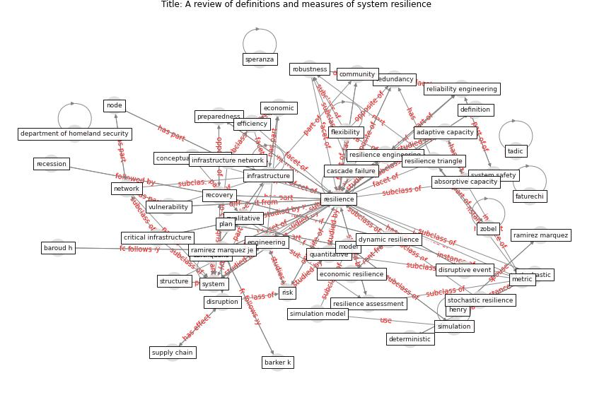

# Article: __A review of definitions and measures of system resilience__ (hosseini_review_2016)

* [10.1016/j.ress.2015.08.006](https://doi.org/10.1016/j.ress.2015.08.006)
* Cluster: [resilience-health](cluster_4)

## Keywords

* [resilience](keyword_resilience), [system](keyword_system), [infrastructure](keyword_infrastructure), [recovery](keyword_recovery), [reliability engineering](keyword_reliability_engineering), [metric](keyword_metric), [system safety](keyword_system_safety), [eq](keyword_eq), [vulnerability](keyword_vulnerability), [resilience engineering](keyword_resilience_engineering), [engineering](keyword_engineering), [preparedness](keyword_preparedness), [disruption](keyword_disruption), [model](keyword_model), [network](keyword_network)

## Keywords at large

* [biophilic design](keyword_biophilic_design), [architecture](keyword_architecture), [sustainable architecture](keyword_sustainable_architecture), [nature](keyword_nature), [design](keyword_design), [biophilic](keyword_biophilic), [environ](keyword_environ), [biophilia](keyword_biophilia), [wellbeing](keyword_wellbeing), [health](keyword_health)

## Abstract

Modeling and evaluating the resilience of systems,
potentially complex and large-scale in nature, has recently
raised significant interest among both practitioners and
researchers. This recent interest has resulted in several
definitions of the concept of resilience and several
approaches to measuring this concept, across several
application domains. As such, this paper presents a review
of recent research articles related to defining and
quantifying resilience in various disciplines, with a focus
on engineering systems. We provide a classification scheme
to the approaches in the literature, focusing on
qualitative and quantitative approaches and their
subcategories. Addressed in this review are: an extensive
coverage of the literature, an exploration of current gaps
and challenges, and several directions for future
research.

## Concepts

 

