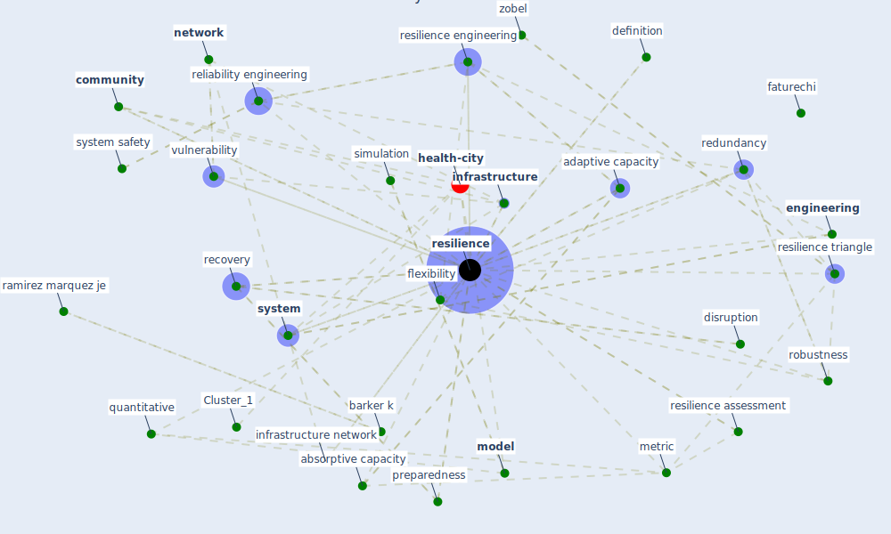

# Article: A review of definitions and measures of system resilience (hosseini_review_2016)

* Source: [10.1016/j.ress.2015.08.006](https://doi.org/10.1016/j.ress.2015.08.006)
* Year: 2016
* Cluster: [resilience-infrastructure](cluster_11)

## Keywords

 * absorptive capacity, adaptive capacity, allen ac, azadeh a, barker k, baroud h, bhamra, bruneau, bruyelle, bruyelle et, cardoso, cascade failure, [china](keyword_china), citespace, [community](keyword_community), cross checking, department of homeland security, detect, deterministic, definition, disruption, disruptive event, [domain](keyword_domain), dynamic resilience, earthquake, ecology, [economic](keyword_economic), economic resilience, efficiency, ej, [engineering](keyword_engineering), entity, faturechi, henry, hollnagel, hollnagel e, [infrastructure](keyword_infrastructure), infrastructure network, khale, khansa, labaka, literature review, [measure](keyword_measure), metric, miller hook, [mitigation](keyword_mitigation), [model](keyword_model), [network](keyword_network), network resilience, node, operation, ouedraogo, ouyang m, philadelphia, [plan](keyword_plan), preparedness, probability, [qualitative](keyword_qualitative), quantitative, ramirez marquez, ramirez marquez je, recession, [recovery](keyword_recovery), recovery time, redundancy, reliability, [reliability engineering](keyword_reliability_engineering), [resilience](keyword_resilience), resilience assessment, resilience definition, resilience engineering, resilience triangle, restoration, review of resilience definition, rise, [risk](keyword_risk), risk management, robustness, salehi v, [simulation](keyword_simulation), [simulation model](keyword_simulation_model), sohr, speranza, stochastic, stochastic resilience, structure, [supply chain](keyword_supply_chain), supply chain resilience, survivability, [system](keyword_system), system safety, tadic, [united states](keyword_united_states), university of pennsylvania, vugrin ed, [vulnerability](keyword_vulnerability), vulnerability reduction, zhejiang, zobel, flexibility

## Concepts

 

## Neighbours

### Closest articles

* Guidelines for resilience systems analysis - [LINK](article_oecd_guidelines_2014)
* Preparing critical infrastructure for the future: Lessons learnt from the Covid-19 pandemic - [LINK](article_tomalska_preparing_2022)
* COVID-19 and a new resilient infrastructure landscape - [LINK](article_oecd_covid-19_2021)
* COVID-19 as a Harbinger of Transforming Infrastructure Resilience - [LINK](article_carvalhaes_covid-19_2020)
* DfMA for rapid adaptive resilience and flexible infrastructure - [LINK](article_mott_macdonald_dfma_2020)
* Mitigation strategies and compliance in the COVID-19 fight; how much compliance is enough? - [LINK](article_mukerjee_mitigation_2021)
* The Intelligent Lockdown: Compliance with COVID-19 Mitigation Measures in the Netherlands - [LINK](article_kuiper_intelligent_2020)
* Compliance with COVID-19 Mitigation Measures in the United States - [LINK](article_van_rooij_compliance_2020)
* A Global Survey of Infection Control and Mitigation Measures for Combating the Transmission of COVID-19 Pandemic in Buildings Under Facilities Management Services - [LINK](article_sarvari_global_2022)

### Closest BPs

* Blueprint: Antimicrobial Surfaces - [LINK](bp_5)
* Blueprint: Good hand hygiene practice - [LINK](bp_16)
* Blueprint: Reducing contact points - [LINK](bp_17)
