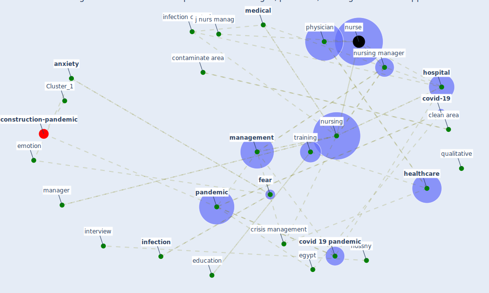

# Article: Management of the COVID-19 pandemic: challenges, practices, and organizational support (hossny_management_2022)

* Source: [10.1186/s12912-022-00972-5](https://doi.org/10.1186/s12912-022-00972-5)
* Year: 2022
* Cluster: [health-city](cluster_1)

## Keywords

 * 2008 summer olympic, aboteage hospital, absenteeism, age, [analysis](keyword_analysis), antiseptic, [anxiety](keyword_anxiety), bmc, [child](keyword_child), [china](keyword_china), [clean](keyword_clean), clean area, code, communication, contaminate area, coreq, [coronavirus](keyword_coronavirus), coronavirus crisis, coronavirus disease, [covid 19 pandemic](keyword_covid_19_pandemic), [covid-19](keyword_covid-19), [crisis](keyword_crisis), crisis management, curfew, [datum](keyword_datum), day, death, [education](keyword_education), egypt, el shafei da, elevator, emotion, esna hospital, exchange process, fear, green zone, guba, head nurse, [health care](keyword_health_care), [healthcare](keyword_healthcare), healthcare personnel, healthcare professional, healthcare worker, [hospital](keyword_hospital), hossny, [infection](keyword_infection), [infection control](keyword_infection_control), interview, isolation, isolation hospital, isolation room, j infect control, j nurs manag, jafar, jama, [knowledge](keyword_knowledge), [management](keyword_management), [manager](keyword_manager), [medical](keyword_medical), ministry of health, morgue, night, nurs, [nurse](keyword_nurse), [nursing](keyword_nursing), nursing director, nursing manager, nursing staff, open, [pandemic](keyword_pandemic), [patient](keyword_patient), physician, policymaker, pract, preparedness, [psychological](keyword_psychological), [public health](keyword_public_health), [qualitative](keyword_qualitative), qualitative research, rapid response team, [research](keyword_research), shift, shortage of nursing staff, sort, staff, staircase, statistic, subtheme, [symptom](keyword_symptom), [training](keyword_training), triage, university hospital, work hour, [world health organization](keyword_world_health_organization), wu f, [wuhan](keyword_wuhan), xu l, yellow zone, zhao s, zone

## Concepts

 

## Neighbours

### Closest articles

* Emergency Healthcare Facilities: Managing Design in a Post Covid-19 World - [LINK](article_marinelli_emergency_2020)
* 10 tech trends getting us through the COVID-19 pandemic - [LINK](article_yan_10_2020)
* Using Technology to Maintain the Education of Residents During the COVID-19 Pandemic - [LINK](article_chick_using_2020)
* Supporting Technologies for COVID-19 Prevention: Systemized Review - [LINK](article_zhao_supporting_2022)
* COVID-19: A new digital dawn? - [LINK](article_robbins_covid-19_2020)
* Overview of the mitigation strategies for COVID-19 pandemic - [LINK](article_ads_overview_2020)
* COVID-19 Bulletin 1: Alterations to BREEAM assessment requirements as a result of the Coronavirus pandemic – Knowledge Base - [LINK](article_breeam_covid-19_2020)
* Covid-19 and community mitigation strategies in a pandemic - [LINK](article_ebrahim_covid-19_2020)
* Response to COVID-19 in Taiwan - [LINK](article_wang_response_2020)

### Closest BPs

* Blueprint: Resilience in staffing and skills training - [LINK](bp_12)
* Blueprint: Negative pressure rooms - [LINK](bp_13)
* Blueprint: Smart Locker System - [LINK](bp_1)
