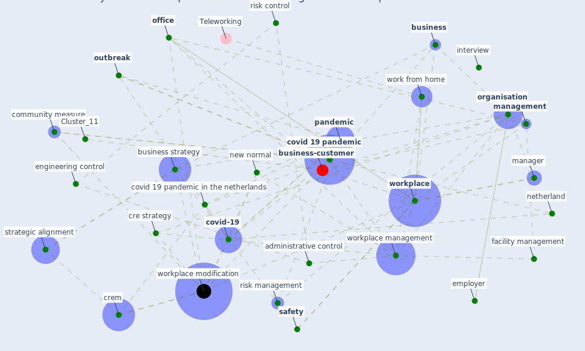

# Article: A study on office workplace modification during the COVID-19 pandemic in The Netherlands (hou_study_2021)

* Source: [10.1108/JCRE-10-2020-0051](https://doi.org/10.1108/JCRE-10-2020-0051)
* Year: 2021
* Cluster: [business-customer](cluster_11)

## Keywords

 * administrative control, [australia](keyword_australia), [build](keyword_build), [business](keyword_business), business abstract, business activity, business climate, business strategy, client side organisation, code technique, collaboration, community measure, [company](keyword_company), control measure, [corporate](keyword_corporate), corporate business strategy, corporation, [covid 19 pandemic](keyword_covid_19_pandemic), covid 19 pandemic in the netherlands, [covid-19](keyword_covid-19), cre, cre manager, cre strategy, crem, crem theory, datum analysis, [economic](keyword_economic), [employee](keyword_employee), [employer](keyword_employer), engineering control, [epidemic](keyword_epidemic), eu recommendation for community measure, [europe](keyword_europe), european, european commission ec, [facility management](keyword_facility_management), facility management team, facility manager, frequently mention topic, [health](keyword_health), health control, hierarchy of control, hou h c, human resource, [industry](keyword_industry), [infection](keyword_infection), influenza pandemic, interview, interview question, joshi, kathuria, keen, literature review, luongo, [management](keyword_management), [manager](keyword_manager), methodology, nenonen, [netherland](keyword_netherland), new normal, [new south wale](keyword_new_south_wale), niosh framework, [office](keyword_office), office space, office workplace modification framework, operation, [organisation](keyword_organisation), [outbreak](keyword_outbreak), [pandemic](keyword_pandemic), pandemic control, pandemic outbreak, [pathogen](keyword_pathogen), [policy](keyword_policy), political, poteete, [public health](keyword_public_health), [qualitative](keyword_qualitative), refurbishment, research methodology, revenue, [risk](keyword_risk), risk control, risk management, [safety](keyword_safety), [social](keyword_social), soft renovation, strategic alignment, [theme](keyword_theme), top management, transcript, uncertainty, [united kingdom](keyword_united_kingdom), virtualisation, work from home, work mode, [workplace](keyword_workplace), [workplace management](keyword_workplace_management), workplace modification, workplace modification plan, workplace safety

## Concepts

 

## Neighbours

### Closest articles

* COVID-19 Experience Transforming the Protective Environment of Office Buildings and Spaces - [LINK](article_phapant_covid-19_2021)
* It’s time to reimagine where and how work will get done (PwC’s US Remote Work Survey) - [LINK](article_pricewaterhousecoopers_its_2021)
* Will a pandemic change building codes? - [LINK](article_rozgus_will_2020)
* How will COVID-19 change future building regulations? - [LINK](article_hmc_architects_how_2020)
* The COVID-19 Impact on Flexible Office Space - [LINK](article_clifton_covid-19_2020)
* Health, Wellbeing \& Productivity in Offices - [LINK](article_world_green_building_council_health_2014)
* Sustainable work throughout the life course: National policies and strategies, Publications Office of the European Union - [LINK](article_eurofund_sustainable_2016)
* Assessment of COVID-19 precautionary measures in sports facilities: A case study on a health club in Saudi Arabia - [LINK](article_ibrahim_assessment_2022)
* Occupant health in buildings: Impact of the COVID-19 pandemic on the opinions of building professionals and implications on research - [LINK](article_awada_occupant_2022)
* Architectural Design Drives the Biogeography of Indoor Bacterial Communities - [LINK](article_kembel_architectural_2014)

### Closest BPs

* Blueprint: Air Cleaning Plants - [LINK](bp_15)
* Blueprint: Installing high-efficiency air filters - [LINK](bp_11)
* Blueprint: Indoor Environmental Quality (IEQ) monitoring system - [LINK](bp_3)
