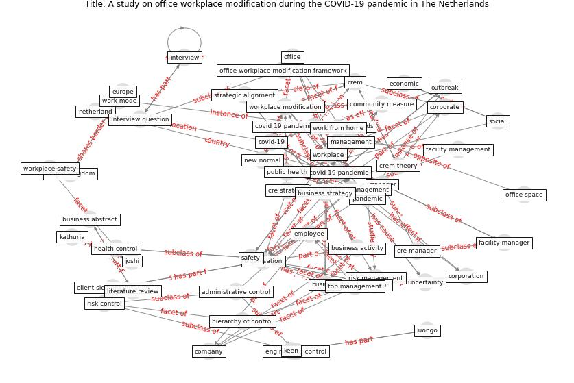

# Article: A study on office workplace modification during the COVID-19 pandemic in The Netherlands (hou_study_2021)

* Source: [10.1108/JCRE-10-2020-0051](https://doi.org/10.1108/JCRE-10-2020-0051)
* Year: 2021
* Cluster: [building-space](cluster_9)

## Keywords

 * administrative control, [australia](keyword_australia), [build](keyword_build), [business](keyword_business), business abstract, business activity, business climate, business strategy, client side organisation, code technique, collaboration, community measure, [company](keyword_company), corporate, corporate business strategy, corporate real estate, corporation, [covid 19 pandemic](keyword_covid_19_pandemic), covid 19 pandemic in the netherlands, [covid-19](keyword_covid-19), cre, cre manager, cre strategy, crem, crem theory, datum analysis, [digital technology](keyword_digital_technology), [economic](keyword_economic), [employee](keyword_employee), [employer](keyword_employer), engineering control, [epidemic](keyword_epidemic), [europe](keyword_europe), european, facility, [facility management](keyword_facility_management), facility management team, facility manager, frequently mention topic, [health](keyword_health), health control, hierarchy of control, human resource, [industry](keyword_industry), [infection](keyword_infection), influenza pandemic, interview, interview question, joshi, journal of corporate real estate, kathuria, keen, literature review, luongo, management, [manager](keyword_manager), methodology, [netherland](keyword_netherland), new normal, [office](keyword_office), office environment, office space, office workplace, office workplace modification framework, operation, operational risk, [organisation](keyword_organisation), [outbreak](keyword_outbreak), [pandemic](keyword_pandemic), pandemic control, [pathogen](keyword_pathogen), personal protection, [personal protective equipment](keyword_personal_protective_equipment), physical workspace, [policy](keyword_policy), [public health](keyword_public_health), [qualitative](keyword_qualitative), real estate, [research](keyword_research), research methodology, risk control, risk management, [safety](keyword_safety), [social](keyword_social), [social distancing](keyword_social_distancing), soft renovation, strategic alignment, top management, transcript, uncertainty, [united kingdom](keyword_united_kingdom), virtual workspace, virtualisation, work from home, work mode, [workplace](keyword_workplace), [workplace management](keyword_workplace_management), workplace modification, workplace modification plan, workplace safety

## Concepts

 

## Neighbours

### Closest articles

* It’s time to reimagine where and how work will get done (PwC’s US Remote Work Survey) - [LINK](article_pricewaterhousecoopers_its_2021)
* Organizations’ Management of the COVID-19 Pandemic: A Scoping Review of Business Articles - [LINK](article_boiral_organizations_2021)
* Responsible Transport: A post-COVID agenda for transport policy and practice - [LINK](article_budd_responsible_2020)
* From Viral City to Smart City: Learning from Pandemic Experiences - [LINK](article_sakellarides_viral_2020)
* Mobility Behaviour in View of the Impact of the COVID-19 Pandemic—Public Transport Users in Gdansk Case Study - [LINK](article_przybylowski_mobility_2021)
* Amplifying the role of knowledge translation platforms in the COVID-19 pandemic response - [LINK](article_el-jardali_amplifying_2020)
* Startups in times of crisis – A rapid response to the COVID-19 pandemic - [LINK](article_kuckertz_startups_2020)
* <scp>COVID</scp>             ‐19: Small and medium enterprises challenges and responses with creativity, innovation, and entrepreneurship - [LINK](article_thukral_covid19_2021)
* How COVID-19 Could Accelerate the Adoption of New Retail Technologies and Enhance the (E-)Servicescape - [LINK](article_willems_how_2021)
* Retail Signage During the COVID-19 Pandemic - [LINK](article_mcneish_retail_2020)

### Closest BPs

* Blueprint: Smart Locker System - [LINK](bp_1)
* Blueprint: One-way mobility circulation - [LINK](bp_4)
* Blueprint: Access limitation - [LINK](bp_7)
