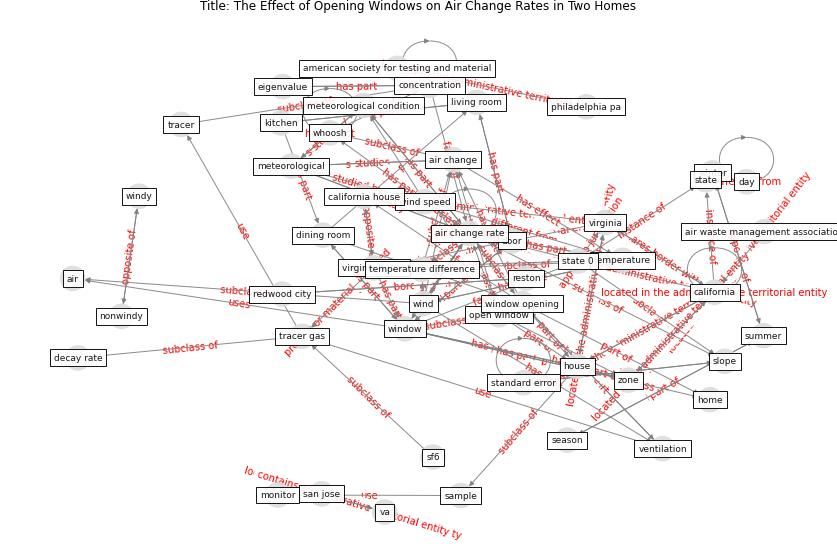

# Article: The Effect of Opening Windows on Air Change Rates in Two Homes (howard-reed_effect_2002)

* Source: [10.1080/10473289.2002.10470775](https://doi.org/10.1080/10473289.2002.10470775)
* Year: 2002
* Cluster: [air-ventilation](cluster_13)

## Keywords

 * [air](keyword_air), air change, [air change rate](keyword_air_change_rate), air waste management association, american society for testing and material, anemometer, assoc, b k, [bedroom](keyword_bedroom), [california](keyword_california), california house, compartment, concentration, day, decay rate, depressurize, dining room, door, dulle, east, eigenvalue, equilibrium, etheridge, experiment, experimental house, floor plan, [home](keyword_home), [house](keyword_house), howard reed, human exposure, [hvac](keyword_hvac), [indoor](keyword_indoor), indoor air, [japan](keyword_japan), kitchen, kvisgaard, level 2 level 1, level 3, level 3 level 1, living room, maryland, master bedroom, may 1995, meteorological, meteorological condition, [monitor](keyword_monitor), national institute of standard and technology, [new york](keyword_new_york), nonwindy, [occupant](keyword_occupant), open, open window, ott, outdoor air, outdoor temperature, pa, philadelphia pa, pressurize, redwood city, reston, reverse stack effect, roulet, [sample](keyword_sample), san jose, san reston, scartezzini, season, second floor, sf6, slope, spring, st petersburg, stack effect, standard error, stanford university, [state](keyword_state), state 0, summer, sustain air change, [temperature](keyword_temperature), temperature difference, tracer, tracer gas, va, [ventilation](keyword_ventilation), [virginia](keyword_virginia), virginia house, volume, wallace, weather, weather condition, whoosh, wind, wind speed, [window](keyword_window), window opening, window opening behavior, windy, [winter](keyword_winter), zone

## Concepts

 

## Neighbours

### Closest articles

* Characterization and performance evaluation of a full-scale activated carbon-based dynamic botanical air filtration system for improving indoor air quality - [LINK](article_wang_characterization_2011)
* The effect of a redesigned floor plan, occupant density and the quality of indoor climate on the cost of space, productivity and sick leave in an office building–A case study - [LINK](article_saari_effect_2006)
* Architectural Design Drives the Biogeography of Indoor Bacterial Communities - [LINK](article_kembel_architectural_2014)
* The effect of occupant distribution on energy consumption and COVID-19 infection in buildings: A case study of university building - [LINK](article_mokhtari_effect_2021)
* Assessment of Building Automation and Control Systems in Danish Healthcare Facilities in the COVID-19 Era - [LINK](article_pedersen_assessment_2022)
* Occupants’ behavior and activity patterns influencing the energy consumption in the Kuwaiti residences - [LINK](article_al-mumin_occupants_2003)
* Reflecting on Impacts of COVID19 on Sustainable Buildings and Cities - [LINK](article_gonzalez_reflecting_2021)
* Addressing the impact of COVID-19 lockdown on energy use in municipal buildings: A case study in Florianópolis, Brazil - [LINK](article_geraldi_addressing_2021)
* Occupant health in buildings: Impact of the COVID-19 pandemic on the opinions of building professionals and implications on research - [LINK](article_awada_occupant_2022)
* Impacts of COVID-19 on residential building energy use and performance - [LINK](article_kawka_impacts_2021)

### Closest BPs

* Blueprint: Air Cleaning Plants - [LINK](bp_15)
* Blueprint: Building Adaptation during a pandemic - [LINK](bp_14)
* Blueprint: Tender support at building stage - [LINK](bp_9)
