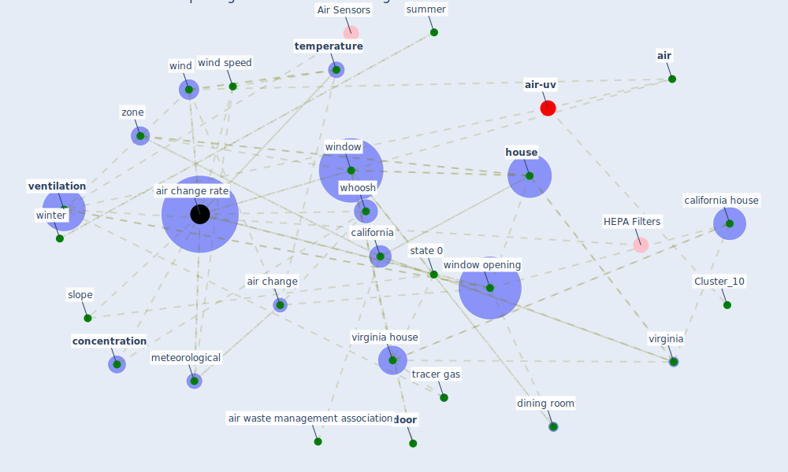

# Article: The Effect of Opening Windows on Air Change Rates in Two Homes (howard-reed_effect_2002)

* Source: [10.1080/10473289.2002.10470775](https://doi.org/10.1080/10473289.2002.10470775)
* Year: 2002
* Cluster: [air-sars](cluster_9)

## Keywords

 * [air](keyword_air), air change, [air change rate](keyword_air_change_rate), air waste management association, american society for testing and material, anemometer, assoc, b k, [bedroom](keyword_bedroom), [california](keyword_california), california house, compartment, concentration, day, decay rate, depressurize, dining room, door, east, eigenvalue, eigenvector, electron capture detector, endorsement, epidemiologist, epidemiologist subj idemiol, equilibrium, etheridge, experiment, floor plan, gas, gas chromatograph, [home](keyword_home), [house](keyword_house), [hvac](keyword_hvac), [indoor](keyword_indoor), indoor air, [japan](keyword_japan), kitchen, kvisgaard, level 2 level 1, level 3, level 3 level 1, living room, maryland, master bedroom, may 1995, meteorological, [monitor](keyword_monitor), [new york](keyword_new_york), nonwindy, [occupant](keyword_occupant), open, open window, ott, outdoor air, outdoor temperature, pa, philadelphia pa, pressurize, redwood city, reston, reverse stack effect, roulet, [sample](keyword_sample), san jose, san reston, scartezzini, season, second floor, sf6, slope, spring, st petersburg, standard error, stanford university, [state](keyword_state), state 0, summer, [temperature](keyword_temperature), temperature difference, tracer, tracer gas, turbulence, [united kingdom](keyword_united_kingdom), va, [ventilation](keyword_ventilation), [virginia](keyword_virginia), virginia house, volume, wallace, weather condition, whoosh, wind, wind speed, [window](keyword_window), window opening, window opening behavior, windy, [winter](keyword_winter), zone

## Concepts

 

## Neighbours

### Closest articles

* Characterization and performance evaluation of a full-scale activated carbon-based dynamic botanical air filtration system for improving indoor air quality - [LINK](article_wang_characterization_2011)
* The effect of a redesigned floor plan, occupant density and the quality of indoor climate on the cost of space, productivity and sick leave in an office building–A case study - [LINK](article_saari_effect_2006)
* COVID-19 Higher Mortality in Chinese Regions With Chronic Exposure to Lower Air Quality - [LINK](article_pansini_covid-19_2021)
* Air pollution linked with higher COVID-19 death rates - [LINK](article_harvard_th_chan_schoold_of_public_health_air_2020)
* Current knowledge of COVID-19: Advances, challenges and future perspectives - [LINK](article_wu_current_2021)
* Physical interventions to interrupt or reduce the spread of respiratory viruses: systematic review - [LINK](article_jefferson_physical_2008)
* KIX to apply antimicrobial coating in its fight against COVID-19 - [LINK](article_kansai_airport_kix_2021)
* Contributions to the mitigation of the COVID-19 pandemic - [LINK](article_pilz_contributions_2022)
* Nurture to nature via COVID-19, a self-regenerating environmental strategy of environment in global context - [LINK](article_paital_nurture_2020)
* COVID-19: Risk assessment and mitigation measures in healthcare and non-healthcare workplaces - [LINK](article_fawzy_covid-19_2021)

### Closest BPs

* Blueprint: Monitoring of wastewater - [LINK](bp_21)
* Blueprint: Negative pressure rooms - [LINK](bp_13)
* Blueprint: Installing UV in ductwork - [LINK](bp_10)
