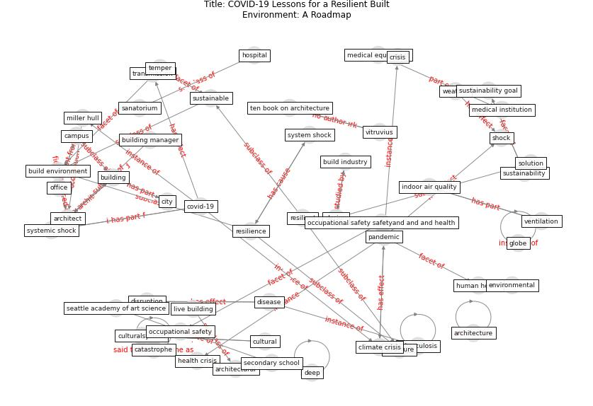

# Article: __COVID-19 Lessons for a Resilient Built Environment: A Roadmap__ (hull_covid-19_2020)

* URL: [https://millerhull.com/2020/covid-19-lessons-for-a-resilient-built-environment-a-roadmap/](https://millerhull.com/2020/covid-19-lessons-for-a-resilient-built-environment-a-roadmap/)
* Year: 2020

## Keywords

* [architect](keyword_architect), [covid-19](keyword_covid-19), [build](keyword_build), [build environment](keyword_build_environment), [pandemic](keyword_pandemic), [miller hull](keyword_miller_hull), [tuberculosis](keyword_tuberculosis), [resilience](keyword_resilience), [design](keyword_design), [climate crisis](keyword_climate_crisis), sustainable, [disease](keyword_disease), globe, deep, [human health](keyword_human_health)

## Keywords at large

* [architect](keyword_architect), [covid-19](keyword_covid-19), [build](keyword_build), [build environment](keyword_build_environment), [pandemic](keyword_pandemic), [miller hull](keyword_miller_hull), [resilience](keyword_resilience), [tuberculosis](keyword_tuberculosis), [climate crisis](keyword_climate_crisis), [design](keyword_design)

## Concepts

 

### Closest articles 

* [Biophilic design in architecture and its contributions to health, well-being, and sustainability: A critical review](article_zhong_biophilic_2022)
* [Navigating Climate Change: Rethinking the Role of Buildings](article_cole_navigating_2020)
* [COVID-19 Could Leverage a Sustainable Built Environment](article_pinheiro_covid-19_2020)
* [Revisiting the built environment: 10 potential development changes and paradigm shifts due to COVID-19](article_cheshmehzangi_revisiting_2021)
* [Antivirus-built environment: Lessons learned from Covid-19 pandemic](article_megahed_antivirus-built_2020)
* [sarvari_global_2022-1](article_sarvari_global_2022-1)
* [A Global Survey of Infection Control and Mitigation Measures for Combating the Transmission of COVID-19 Pandemic in Buildings Under Facilities Management Services](article_sarvari_global_2022)
* [The City Under COVID‐19: Podcasting As Digital Methodology](article_rogers_city_2020)
* [The Impact of COVID-19 on Public Space: A Review of the Emerging Questions](article_honey-roses_impact_2020)
* [Coronavirus questions that will not go away: interrogating urban and socio-spatial implications of COVID-19 measures](article_salama_coronavirus_2020)

