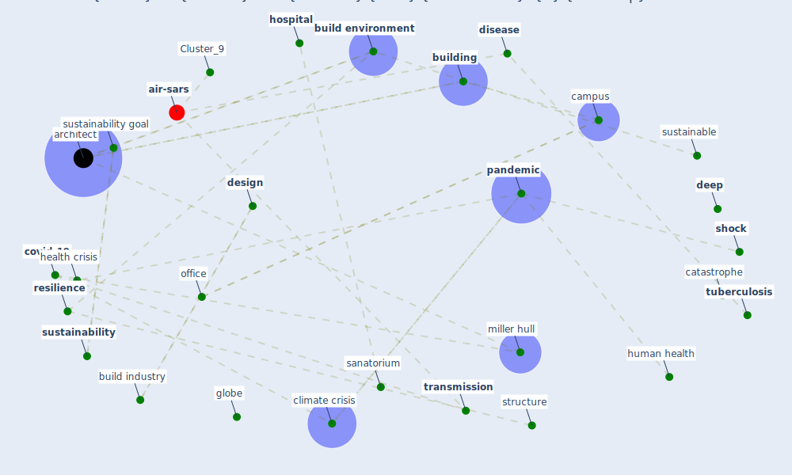

# Article: COVID-19 Lessons for a Resilient Built Environment: A Roadmap (hull_covid-19_2020)

* [https://millerhull.com/2020/covid-19-lessons-for-a-resilient-built-environment-a-roadmap/](https://millerhull.com/2020/covid-19-lessons-for-a-resilient-built-environment-a-roadmap/)
* Year: 2020
* Cluster: [air-sars](cluster_9)

## Keywords

 * already affect our planet s capacity to sustain human life, [architect](keyword_architect), architectural, [architecture](keyword_architecture), [build](keyword_build), [build environment](keyword_build_environment), build industry, builder, [building](keyword_building), building manager, business as usual, campus, catastrophe, cern, charity, [cholera](keyword_cholera), [city](keyword_city), climate crisis, covd 19, [covid-19](keyword_covid-19), [crisis](keyword_crisis), cultural, culturalsystem, daylight, [deep](keyword_deep), [design](keyword_design), [disease](keyword_disease), disruption, do good, earthquake, economic sector, elevator, [environment](keyword_environment), environmental, exercise, existence, first systemic shock, five miller hull, fordisease disease, globe, globe globe, globe globe globe, go deep, good, goodwill, great chicago fire, [health](keyword_health), health crisis, health safety and welfare, [hospital](keyword_hospital), [human health](keyword_human_health), incoronavirus coronavirus coronavirusdisease disease, [indoor air quality](keyword_indoor_air_quality), learn, live building, los angeles, marine corps recruit depot, market sector, mesa college, miller hull, [office](keyword_office), [pandemic](keyword_pandemic), paris, post covid 19, regenerative design, [resilience](keyword_resilience), [resilient](keyword_resilient), [safety](keyword_safety), sanatorium, seattle academy, seattle academy of art science, secondary school, [shock](keyword_shock), [solution](keyword_solution), steel frame, structure, style, sunbathe, [sustainability](keyword_sustainability), sustainability goal, sustainable, [switzerland](keyword_switzerland), [system](keyword_system), system shock, systemic shock, temper, temper they, ten book on architecture, the pandemic, thesar cov 2 sar cov 2 sar cov 2virus virus, thesar cov 2 sar cov 2 sar cov 2virus virus virus, [transmission](keyword_transmission), [tuberculosis](keyword_tuberculosis), [united states](keyword_united_states), [ventilation](keyword_ventilation), vitruvius, vitruvius ten book on architecture, [vulnerability](keyword_vulnerability), weather, [window](keyword_window)

## Concepts

 

## Neighbours

### Closest articles

* How Architecture Fails in Conditions of Crisis: a Discussion on the Value of Interior Design over the COVID-19 Outbreak - [LINK](article_rassia_how_2020)
* Biophilic design in architecture and its contributions to health, well-being, and sustainability: A critical review - [LINK](article_zhong_biophilic_2022)
* Adaptive Design of the Built Environment to Mitigate the Transmission Risk of COVID-19 - [LINK](article_ara_dilshad_shangi_adaptive_2020)
* How the Coronavirus Will Reshape Architecture - [LINK](article_chayka_how_2020)
* Architectural Design Drives the Biogeography of Indoor Bacterial Communities - [LINK](article_kembel_architectural_2014)
* Designing for COVID-2x: Reflecting on Future-Proofing Human Habitation for the Inevitable Next Pandemic - [LINK](article_spennemann_designing_2022)
* RESIDENTIAL ARCHITECTURE IN A POST-PANDEMIC WORLD: IMPLICATIONS OF COVID-19 FOR NEW CONSTRUCTION AND FOR ADAPTING HERITAGE BUILDINGS - [LINK](article_spennemann_residential_2021)
* Houses amid COVID-19: Environmental challenges and design adaptation - [LINK](article_hizra_houses_2021)
* The COVID-19 Impact on Flexible Office Space - [LINK](article_clifton_covid-19_2020)

### Closest BPs

* Blueprint: Tracking and enforcing use of Personal Protective Equipment - [LINK](bp_23)
* Blueprint: Building Adaptation during a pandemic - [LINK](bp_14)
* Blueprint: Architecture design - [LINK](bp_2)
