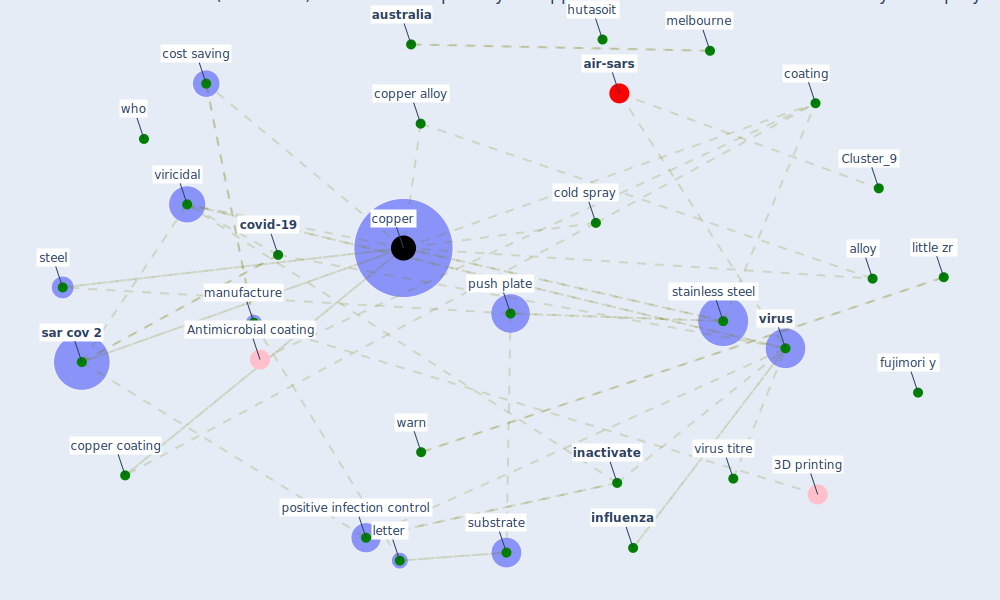

# Article: Sars-CoV-2 (COVID-19) inactivation capability of copper-coated touch surface fabricated by cold-spray technology (hutasoit_sars-cov-2_2020)

* Source: [10.1016/j.mfglet.2020.08.007](https://doi.org/10.1016/j.mfglet.2020.08.007)
* Year: 2020
* Cluster: [health-city](cluster_1)

## Keywords

 * 2009 pandemic, SARS-CoV-2, alloy, anneal, anti influenza, anticovid19, [antimicrobial](keyword_antimicrobial), [antiviral](keyword_antiviral), as deposit, assay medium, [australia](keyword_australia), capsid, [coating](keyword_coating), cold spray, cold spray technique, contact surface, [control](keyword_control), [copper](keyword_copper), copper alloy, copper coat, copper coating, cost saving, covid 19 virus, [covid-19](keyword_covid-19), cross section, dilution, [door](keyword_door), door handle, doremalen, economical, [energy](keyword_energy), exposure time, freedman do, fujimori, fujimori y, future industry sector growth funding program, h1n1 influenza virus, [hospital](keyword_hospital), human contact, hutasoit, inactivate, infection control medium titre, [infectious](keyword_infectious), infective, [influenza](keyword_influenza), inject, keevil, kinetic energy, kristin s, letter, lightspee3d, little zr, [manufacture](keyword_manufacture), medication, [melbourne](keyword_melbourne), metal, metallic, nano particle, nozzle, [pandemic](keyword_pandemic), [person](keyword_person), polish, positive infection control, practical, program, [public health](keyword_public_health), push plate, reed, reed muench, replace, respiratory droplet, respiratory system, robot arm, [sar cov 1](keyword_sar_cov_1), [sar cov 2](keyword_sar_cov_2), severe acute respiratory syndrome coronavirus 2, six axis, spee3d, [stainless steel](keyword_stainless_steel), steel, substrate, surface exposure, swinburne university of technology, thickness, [transmission](keyword_transmission), [unesco](keyword_unesco), [vaccine](keyword_vaccine), van doremalen, van doremalen et, vero, victor c, viricidal, [virus](keyword_virus), virus titre, warn, warne sl, who, wilder smith, william shakespeare, [world heritage site](keyword_world_heritage_site)

## Concepts

 

## Neighbours

### Closest articles

* A Surface Coating that Rapidly Inactivates SARS-CoV-2 - [LINK](article_behzadinasab_surface_2020)
* Graphene-based nanomaterials as antimicrobial surface coatings: A parallel approach to restrain the expansion of COVID-19 - [LINK](article_ayub_graphene-based_2021)
* A Continuously Active Antimicrobial Coating effective against Human Coronavirus 229E - [LINK](article_ikner_continuously_2020)
* KIX to apply antimicrobial coating in its fight against COVID-19 - [LINK](article_kansai_airport_kix_2021)
* Aerosol and Surface Stability of SARS-CoV-2 as Compared with SARS-CoV-1 - [LINK](article_van_doremalen_aerosol_2020)
* Sustainability of Coronavirus on Different Surfaces - [LINK](article_suman_sustainability_2020)
* Persistence of coronaviruses on inanimate surfaces and their inactivation with biocidal agents - [LINK](article_kampf_persistence_2020)
* Current knowledge of COVID-19: Advances, challenges and future perspectives - [LINK](article_wu_current_2021)
* COVID-19 Pandemic: Prevention and Protection Measures to Be Adopted at the Workplace - [LINK](article_cirrincione_covid-19_2020)
* DfMA for rapid adaptive resilience and flexible infrastructure - [LINK](article_mott_macdonald_dfma_2020)

### Closest BPs

* Blueprint: Resilience in staffing and skills training - [LINK](bp_12)
* Blueprint: Negative pressure rooms - [LINK](bp_13)
* Blueprint: Smart Locker System - [LINK](bp_1)
