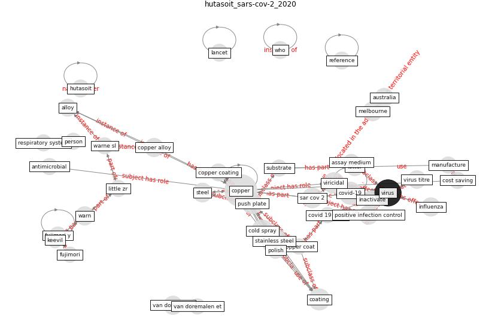

# Article: __Sars-CoV-2 (COVID-19) inactivation capability of copper-coated touch surface fabricated by cold-spray technology__ (hutasoit_sars-cov-2_2020)

* [10.1016/j.mfglet.2020.08.007](https://doi.org/10.1016/j.mfglet.2020.08.007)
* Cluster: [air-sars](cluster_2)

## Keywords

[virus](keyword_virus)

## Concepts

 

### References 

* [Aerosol and Surface Stability of SARS-CoV-2 as
Compared with SARS-CoV-1](article_van_doremalen_aerosol_2020)
* [Air, Surface Environmental, and Personal
Protective Equipment Contamination by Severe
Acute Respiratory Syndrome Coronavirus 2
(SARS-CoV-2) From a Symptomatic Patient](article_ong_air_2020)

### Cited by 

* [Prophylactic Architecture: Formulating the Concept
of Pandemic-Resilient Homes](article_elrayies_prophylactic_2022)
* [Designing Post COVID-19 Buildings: Approaches for
Achieving Healthy Buildings](article_navaratnam_designing_2022)
