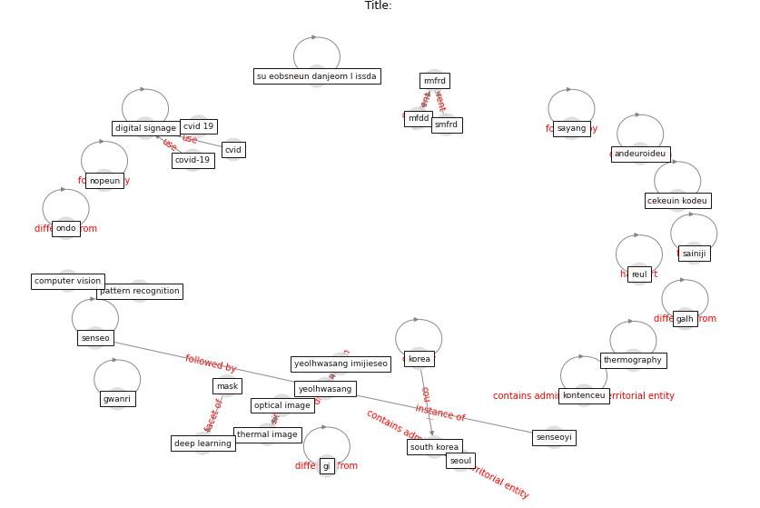

# Article:  (huy-tran_design_2022)

* Source: [10.9717/KMMS.2022.25.1.010](https://doi.org/10.9717/KMMS.2022.25.1.010)
* Year: 2022
* Cluster: [health-patient](cluster_14)

## Keywords

 * 15는 논문에서, 2장에서 본 논문의, 35 c, body temperature, [computer vision](keyword_computer_vision), [covid-19](keyword_covid-19), cvid, dongjak gu, eye corner, face detection, facemaskdetector, fever detection, gpu, human body, image, imagenet, infrare, ki pass qr code checking, [korea](keyword_korea), m j lee, [mask](keyword_mask), mfdd, opencv, pattern recognition, rk3399, rmfrd, rockchip, [sample](keyword_sample), [seoul](keyword_seoul), smfrd, [south korea](keyword_south_korea), [taiwan](keyword_taiwan), tensorflow, thermography, udp, y m kim, 값이 있는 얼굴의 측정 부위에 따라 달라질, 같이, 개인의, 것으로, 계산 등에 오차가 많이 발생할 수있다, 관리, 국제표준기구 8, 기기, 기기는, 기기에, 높은, 달리 보고할 만한 것이 없으며, 대한, 동작은 먼 저 최소 30분의 워밍업 시간과, 디스플레이 컨트롤러는, 따라서, 마스크 검출, 물체에서 방출되는 복사의, 발열 점검, 방역당국은, 보고하였다, 본 논문에서, 부분을, 분산 보관되고, 블랙바디, 사양, [사이니지](keyword_사이니지), 새로운, 센서, 센서의, 센서의 측정 온도를 이용하여 열화상, 수 없는 단점 이 있다, 안드로이드, 알고리즘, 어디에, 얼굴, 역에서, [열화상](keyword_열화상), 열화상 이미지들을 opencv, 열화상 이미지에서, 온도, 의 안 드로이드 얼굴 검출 api 17 를 이용하였다, 있다, 적외선, 적외선을 변할 수 있다, 전환이 이 루어 졌으며, 정보, 정보를, 제공한다, 지를, 참조하기로, 체온, 체크인 코드, 체킹, 측정, 측정은 주로 적외선 이용, 코드, 코어, 콘텐츠, 콘트롤러, 표를, 표면의 온도에 비례한다, 프레젠테이션, 프로세서로

## Concepts

 

## Neighbours

### Closest articles

* An Automated System to Limit COVID-19 Using Facial Mask Detection in Smart City Network - [LINK](article_rahman_automated_2020)
* DeepSOCIAL: Social Distancing Monitoring and Infection Risk Assessment in COVID-19 Pandemic - [LINK](article_rezaei_deepsocial_2020)
* Towards the sustainable development of smart cities through mass video surveillance: A response to the COVID-19 pandemic - [LINK](article_shorfuzzaman_towards_2021)
* How the 5G Enabled the COVID-19 Pandemic Prevention and Control: Materiality, Affordance, and (De-)Spatialization - [LINK](article_li_how_2022)
* Design COVID-19 Ontology: A Healthcare and Safety Perspective - [LINK](article_aloulou_design_2022)
* How COVID-19 Redefines the Concept of Sustainability - [LINK](article_hakovirta_how_2020)
* COVID-19: IMPACT OF THE PANDEMIC ON THE SUSTAINABLE DEVELOPMENT GOALS - [LINK](article_samout_covid-19_2020)
* Building up an ecologically sustainable and socially desirable post-COVID-19 future - [LINK](article_duflot_building_2021)
* COVID-19 and the UN Sustainable Development Goals: Threat to Solidarity or an Opportunity? - [LINK](article_leal_filho_covid-19_2020)
* Health, Economic and Social Development Challenges of the COVID-19 Pandemic: Strategies for Multiple and Interconnected Issues - [LINK](article_panneer_health_2022)

### Closest BPs

* Blueprint: Resilience in staffing and skills training - [LINK](bp_12)
* Blueprint: Smart Locker System - [LINK](bp_1)
* Blueprint: Rotational Shift System - [LINK](bp_0)
