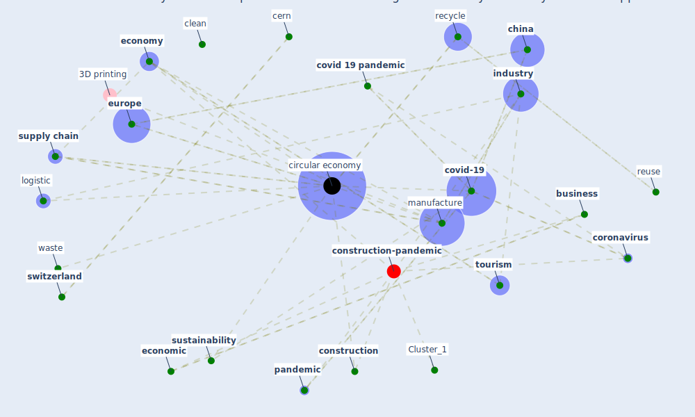

# Article: A critical analysis of the impacts of COVID-19 on the global economy and ecosystems and opportunities for circular economy strategies (ibn-mohammed_critical_2021)

* Source: [10.1016/j.resconrec.2020.105169](https://doi.org/10.1016/j.resconrec.2020.105169)
* Year: 2021
* Cluster: [construction-pandemic](cluster_1)

## Keywords

 * agriculture, [air pollution](keyword_air_pollution), airbnb, automation, aviation, aviation industry, az, battery, behaviour, [build environment](keyword_build_environment), [business](keyword_business), business model, [canada](keyword_canada), cern, [china](keyword_china), [circular economy](keyword_circular_economy), [clean](keyword_clean), [climate change](keyword_climate_change), climb, conservation, [construction](keyword_construction), [coronavirus](keyword_coronavirus), [covid 19 pandemic](keyword_covid_19_pandemic), [covid-19](keyword_covid-19), develop, disassembly, [disease](keyword_disease), [economic](keyword_economic), economic growth, economic research, [economy](keyword_economy), elen macarthur foundation, ellen macarthur, [energy](keyword_energy), energy demand, [engineering](keyword_engineering), eocene, [epidemic](keyword_epidemic), [europe](keyword_europe), european, european commission, [european union](keyword_european_union), export, [health](keyword_health), [health care](keyword_health_care), [healthcare](keyword_healthcare), [india](keyword_india), indust, [industry](keyword_industry), [infrastructure](keyword_infrastructure), linear economy, [lockdown](keyword_lockdown), [logistic](keyword_logistic), [london](keyword_london), macharis, [manufacture](keyword_manufacture), mkb, [outbreak](keyword_outbreak), [pandemic](keyword_pandemic), panic buying, passenger, peri urban agriculture, philadelphia, plastic, [policy](keyword_policy), [pollutant](keyword_pollutant), pollution, [public health](keyword_public_health), [re psychiatry](keyword_re_psychiatry), [recycle](keyword_recycle), refurbishment, renovation, retardant, reuse, san francisco, [sanitation](keyword_sanitation), share economy, ssrn, stockholm, [supply](keyword_supply), [supply chain](keyword_supply_chain), [sustainability](keyword_sustainability), [switzerland](keyword_switzerland), telford ltd, thomas telford, [tourism](keyword_tourism), trade policy, [transport](keyword_transport), transportation, [united kingdom](keyword_united_kingdom), university of pennsylvania, [urban](keyword_urban), value chain, [ventilator](keyword_ventilator), [virus](keyword_virus), waste, waste manag, waste management, world, [wuhan](keyword_wuhan)

## Concepts

 

## Neighbours

### Closest articles

* Building up an ecologically sustainable and socially desirable post-COVID-19 future - [LINK](article_duflot_building_2021)
* COVID-19: IMPACT OF THE PANDEMIC ON THE SUSTAINABLE DEVELOPMENT GOALS - [LINK](article_samout_covid-19_2020)
* Urban planning after COVID-19 - [LINK](article_rtpi_urban_2021)
* COVID-19 and the UN Sustainable Development Goals: Threat to Solidarity or an Opportunity? - [LINK](article_leal_filho_covid-19_2020)
* How COVID-19 Redefines the Concept of Sustainability - [LINK](article_hakovirta_how_2020)
* Health, Economic and Social Development Challenges of the COVID-19 Pandemic: Strategies for Multiple and Interconnected Issues - [LINK](article_panneer_health_2022)
* The COVID-19 pandemic: Lessons on building more equal and sustainable societies - [LINK](article_van_barneveld_covid-19_2020)
* Revisiting the built environment: 10 potential development changes and paradigm shifts due to COVID-19 - [LINK](article_cheshmehzangi_revisiting_2021)
* Proximity and post-COVID-19 urban development: Reflections from Milan, Italy - [LINK](article_tricarico_proximity_2021)
*  - [LINK](article_yakubu_aminu_dodo_green_2020)

### Closest BPs

* Blueprint: Smart Locker System - [LINK](bp_1)
* Blueprint: Mental health – Belong: Do something with someone - [LINK](bp_19)
* Blueprint: Mental health – Act: Do something - [LINK](bp_18)
