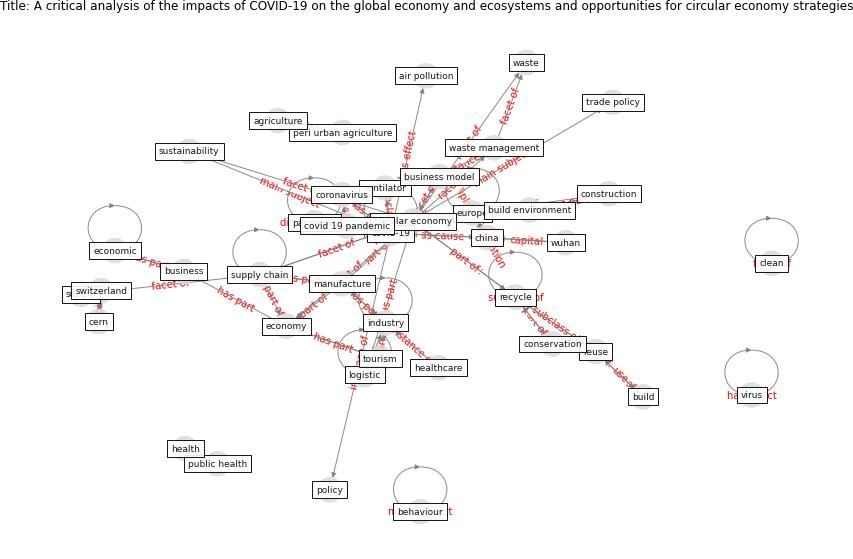

# Article: __A critical analysis of the impacts of COVID-19 on the global economy and ecosystems and opportunities for circular economy strategies__ (ibn-mohammed_critical_2021)

* [10.1016/j.resconrec.2020.105169](https://doi.org/10.1016/j.resconrec.2020.105169)
* Cluster: [health-city](cluster_0)

## Keywords

[pandemic](keyword_pandemic), [china](keyword_china)

## Concepts

 

### References 

* [COVID-19 Could Leverage a Sustainable Built
Environment](article_pinheiro_covid-19_2020)

### Cited by 

* [Addressing the impact of COVID-19 lockdown on energy use
in municipal buildings: A case study in Florianópolis,
Brazil](article_geraldi_addressing_2021)
* [Assessment of Building Automation and Control
Systems in Danish Healthcare Facilities in the
COVID-19 Era](article_pedersen_assessment_2022)
