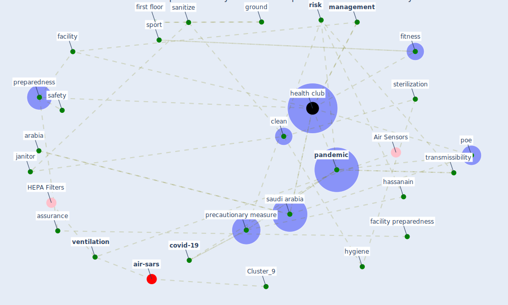

# Article: Assessment of COVID-19 precautionary measures in sports facilities: A case study on a health club in Saudi Arabia (ibrahim_assessment_2022)

* Source: [10.1016/j.jobe.2021.103662](https://doi.org/10.1016/j.jobe.2021.103662)
* Year: 2022
* Cluster: [air-sars](cluster_9)

## Keywords

 * administrative staff, age, [air](keyword_air), air duct, air supply, arabia, asian country, assurance, athlete, bike, body building exercise, [boston](keyword_boston), case study, change booth, checklist, [china](keyword_china), [chlorine](keyword_chlorine), circulation, [clean](keyword_clean), color control, competition, [control](keyword_control), [corridor](keyword_corridor), [covid-19](keyword_covid-19), diffuser, [disinfection](keyword_disinfection), equipment, facility, [facility management](keyword_facility_management), facility preparedness, first floor, fitness, fitness club, foyer, gender, [government](keyword_government), ground, gym, hand sanitizer, hassanain, [health club](keyword_health_club), high risk, [hong kong](keyword_hong_kong), [hvac](keyword_hvac), hygiene, infrare, [interaction](keyword_interaction), janitor, literature review, ljubljana, locker, madrid, [management](keyword_management), [mask](keyword_mask), member, methodology, [monitor](keyword_monitor), mullen, norway, operation, [pandemic](keyword_pandemic), pandemic propagation, poe, pool, post occupancy evaluation, post-pandemic, [precautionary measure](keyword_precautionary_measure), preiser, preparedness, propagation, [research](keyword_research), residual, [risk](keyword_risk), riyadh, sa fvenbom, [safety](keyword_safety), sanitization, sanitize, sanitizer, saudi, [saudi arabia](keyword_saudi_arabia), sauna, [security](keyword_security), [slovenia](keyword_slovenia), [spain](keyword_spain), sport, sport club, sport facility, stair, steam bath, sterilization, sterilize, transmissibility, treadmill, tv, university of pennsylvania, [usa](keyword_usa), [ventilation](keyword_ventilation), warning tape, whaley

## Concepts

 

## Neighbours

### Closest articles

* Urban Community Sustainable Development Patterns under the Influence of COVID-19: A Case Study Based on the Non-Contact Interaction Perspective of Hangzhou City - [LINK](article_wang_urban_2021)
* COVID-19 Bulletin 1: Alterations to BREEAM assessment requirements as a result of the Coronavirus pandemic – Knowledge Base - [LINK](article_breeam_covid-19_2020)
* Housing Experience in Gated Communities in the Time of Pandemics: Lessons Learned from COVID-19 - [LINK](article_asfour_housing_2022)
* Social distancing enhanced automated optimal design of physical spaces in the wake of the COVID-19 pandemic - [LINK](article_ugail_social_2021)
* Attitudes towards outdoor and neighbour noise during the COVID-19 lockdown: A case study in London - [LINK](article_lee_attitudes_2021)
* Eviction, Health Inequity, and the Spread of COVID-19: Housing Policy as a Primary Pandemic Mitigation Strategy - [LINK](article_benfer_eviction_2021)
* Assessing the health and hygiene performance of apartment buildings - [LINK](article_ho_assessing_2004)
* Exploring the Non-Medical impacts of Covid-19 using Natural Language Processing - [LINK](article_agade_exploring_2020)
* A Platform for Citizen Cooperation during the COVID-19 Pandemic in RN, Brazil - [LINK](article_de_araujo_platform_2020)
* Dangerous liaisons? Applying the social harm perspective to the social inequality, housing and health trifecta during the Covid-19 pandemic - [LINK](article_gurney_dangerous_2021)

### Closest BPs

* Blueprint: Resilience in staffing and skills training - [LINK](bp_12)
* Blueprint: Tracking and enforcing use of Personal Protective Equipment - [LINK](bp_23)
* Blueprint: Public places as information points - [LINK](bp_8)
