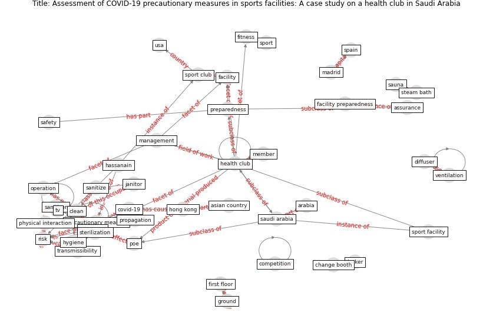

# Article: __Assessment of COVID-19 precautionary measures in sports facilities: A case study on a health club in Saudi Arabia__ (ibrahim_assessment_2022)

* [10.1016/j.jobe.2021.103662](https://doi.org/10.1016/j.jobe.2021.103662)
* Cluster: [building-health](cluster_10)

## Keywords

[pandemic](keyword_pandemic), [risk](keyword_risk), [ventilation](keyword_ventilation), [safety](keyword_safety)

## Concepts

 

### References 

* [Review and comparison of HVAC operation guidelines in
different countries during the COVID-19 pandemic](article_guo_review_2021)

### Cited by 

