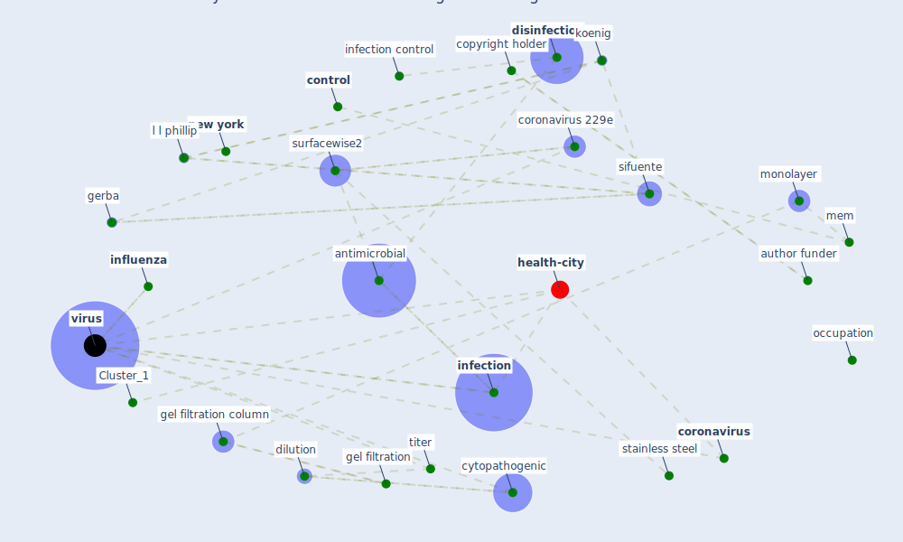

# Article: A Continuously Active Antimicrobial Coating effective against Human Coronavirus 229E (ikner_continuously_2020)

* Source: [10.1101/2020.05.10.20097329](https://doi.org/10.1101/2020.05.10.20097329)
* Year: 2020
* Cluster: [air-sars](cluster_9)

## Keywords

 * aliquote, ally bioscience, american society of testing and material, anti viral, [antimicrobial](keyword_antimicrobial), [australia](keyword_australia), [author funder](keyword_author_funder), autoclave, [build](keyword_build), carrier, caslino, cell culture, cell line, centrifuge, chloride, [clean](keyword_clean), [coating](keyword_coating), colloild, common cold, contaminate, contr, [control](keyword_control), [copyright holder](keyword_copyright_holder), [coronavirus](keyword_coronavirus), coronavirus 229e, cytopathogenic, dilution, [disinfectant](keyword_disinfectant), [disinfection](keyword_disinfection), door, efficacy, fibroblast mrc 5, fomite, gel filtration, gel filtration column, [gerba](keyword_gerba), gram negative, gram positive, hotel, hygiene protocol, [infection](keyword_infection), [infection control](keyword_infection_control), infectious, infectious virus, [influenza](keyword_influenza), koenig, kraków, l l phillip, l p, lbb, lesile, letheen broth base, long term care facility, mem, microactivity, microbe, [microbiol](keyword_microbiol), monolayer, [new south wale](keyword_new_south_wale), [new york](keyword_new_york), occupation, overnight, [pathogen](keyword_pathogen), payment, ph, phosphate buffer saline, pogreba brown, [poland](keyword_poland), polyethylene, polyethylene glycol, [polymer](keyword_polymer), publication, ready to use, recontamination, reduction, respiratory virus, sanitizer, santa martin, self disinfect, self disinfect coating, self disinfect surface, selfdisinfecting, sephadex, sifuente, sodium chloride, spectrometer, [stainless steel](keyword_stainless_steel), sterilize, store, surfacewise2, suspension, test condition, titer, trudel, virol virol, virology, [virus](keyword_virus), virus stock suspension, vrol, xrf

## Concepts

 

## Neighbours

### Closest articles

* Graphene-based nanomaterials as antimicrobial surface coatings: A parallel approach to restrain the expansion of COVID-19 - [LINK](article_ayub_graphene-based_2021)
* Sars-CoV-2 (COVID-19) inactivation capability of copper-coated touch surface fabricated by cold-spray technology - [LINK](article_hutasoit_sars-cov-2_2020)
* A Surface Coating that Rapidly Inactivates SARS-CoV-2 - [LINK](article_behzadinasab_surface_2020)
* KIX to apply antimicrobial coating in its fight against COVID-19 - [LINK](article_kansai_airport_kix_2021)
* Aerosol and Surface Stability of SARS-CoV-2 as Compared with SARS-CoV-1 - [LINK](article_van_doremalen_aerosol_2020)
* Persistence of coronaviruses on inanimate surfaces and their inactivation with biocidal agents - [LINK](article_kampf_persistence_2020)
* Sustainability of Coronavirus on Different Surfaces - [LINK](article_suman_sustainability_2020)
* Recently employed engineering techniques to reduce the spread of COVID-19 (corona virus disease 2019): a review study - [LINK](article_saman_recently_2021)
* Current knowledge of COVID-19: Advances, challenges and future perspectives - [LINK](article_wu_current_2021)
* Efficacy of an Automated Multiple Emitter Whole-Room Ultraviolet-C Disinfection System Against Coronaviruses MHV and MERS-CoV - [LINK](article_bedell_efficacy_2016)

### Closest BPs

* Blueprint: Installing UV in ductwork - [LINK](bp_10)
* Blueprint: Monitoring of wastewater - [LINK](bp_21)
* Blueprint: Negative pressure rooms - [LINK](bp_13)
