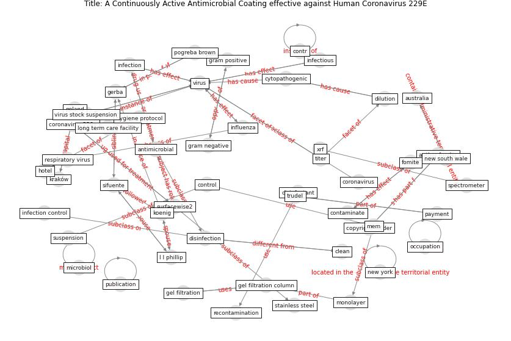

# Article: __A Continuously Active Antimicrobial Coating effective against Human Coronavirus 229E__ (ikner_continuously_2020)

* [10.1101/2020.05.10.20097329](https://doi.org/10.1101/2020.05.10.20097329)
* Cluster: [air-sars](cluster_0)

## Keywords

* [virus](keyword_virus), [author funder](keyword_author_funder), [copyright holder](keyword_copyright_holder), [infection](keyword_infection), gerba, [antimicrobial](keyword_antimicrobial), [international license](keyword_international_license), [sifuente](keyword_sifuente), [cc by nc nd 4 0](keyword_cc_by_nc_nd_4_0), [titer](keyword_titer), [disinfection](keyword_disinfection), [disinfectant](keyword_disinfectant), coronavirus 229e, [control](keyword_control), [influenza](keyword_influenza)

## Keywords at large

* [virus](keyword_virus), [copyright holder](keyword_copyright_holder), [author funder](keyword_author_funder), [infection](keyword_infection), [antimicrobial](keyword_antimicrobial), [new york](keyword_new_york), [sifuente](keyword_sifuente), [cc by nc nd 4 0](keyword_cc_by_nc_nd_4_0), [international license](keyword_international_license)

## Abstract

Abstract The disinfection of high-contact surfaces is seen
as an infection control practice to prevent the spread of
pathogens by fomites. Unfortunately, recontamination of
these surfaces can occur any time after the use of common
disinfectants. We recently reported on a novel continuously
active antimicrobial coating which was shown to reduce the
spread of healthcare acquired infections in hospitals. We
evaluated a modified coating that demonstrated a residual
efficacy against viruses. The coated surfaces were found to
be effective against human coronavirus (HCoV) 229E,
reducing the concentration of these viruses by greater than
90\% in 10 minutes and by greater than 99.9\% after two
hours of contact. The coating formulation when tested in
suspension yielded a greater than 99.99\% reduction of HCoV
229E within ten minutes of contact. This outcome presents
an opportunity for controlling the transmission of COVID-19
from contaminated fomites.

## Concepts

 

### Closest articles 

* [A Surface Coating that Rapidly Inactivates SARS-CoV-2](article_behzadinasab_surface_2020)
* [Sars-CoV-2 (COVID-19) inactivation capability of copper-coated touch surface fabricated by cold-spray technology](article_hutasoit_sars-cov-2_2020)
* [Graphene-based nanomaterials as antimicrobial surface coatings: A parallel approach to restrain the expansion of COVID-19](article_ayub_graphene-based_2021)
* [KIX to apply antimicrobial coating in its fight against
COVID-19](article_kansai_airport_kix_2021)
* [Aerosol and Surface Stability of SARS-CoV-2 as Compared with SARS-CoV-1](article_van_doremalen_aerosol_2020)
* [Sustainability of Coronavirus on Different Surfaces](article_suman_sustainability_2020)
* [Persistence of coronaviruses on inanimate surfaces and their inactivation with biocidal agents](article_kampf_persistence_2020)
* [Current knowledge of COVID-19: Advances, challenges and future perspectives](article_wu_current_2021)
* [harvard_chan_community_coronavirus_2020](article_harvard_chan_community_coronavirus_2020)
* [Coronavirus and Climate Change](article_harvard_th_chan_schoold_of_public_health_coronavirus_2020)

