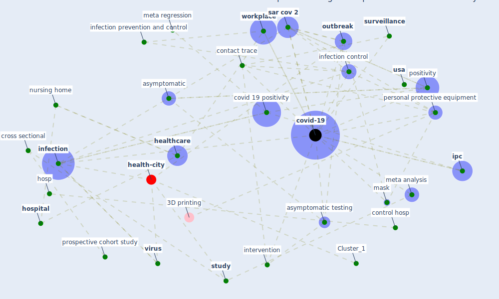

# Article: COVID-19 Prevention and Control Measures in Workplace Settings: A Rapid Review and Meta-Analysis (ingram_covid-19_2021)

* Source: [10.3390/ijerph18157847](https://doi.org/10.3390/ijerph18157847)
* Year: 2021
* Cluster: [health-city](cluster_1)

## Keywords

 * airborne transmission, america, asymptomatic, asymptomatic testing, [australia](keyword_australia), bansal, belgium, bias, breslin, cell, [china](keyword_china), coclite, cohort study, combine measure, community transmission, contact trace, control hosp, [coronavirus](keyword_coronavirus), covid 19 outbreak, [covid 19 pandemic](keyword_covid_19_pandemic), covid 19 positivity, [covid-19](keyword_covid-19), cross sectional, datum extraction, downey, [education](keyword_education), effective, epicentre, epidemiologist, epidemiologist subj idemiol, [europe](keyword_europe), eye protection, face protection, [germany](keyword_germany), gunawardana, hcw, health care system, [healthcare](keyword_healthcare), healthcare worker, hosp, [hospital](keyword_hospital), iannone, [india](keyword_india), [infection](keyword_infection), [infection control](keyword_infection_control), [infection prevention and control](keyword_infection_prevention_and_control), [infectious](keyword_infectious), infectious disease outbreak, ingram, intervention, [ipc](keyword_ipc), [italy](keyword_italy), kabesch, [korea](keyword_korea), lakkireddy, [low](keyword_low), [manhattan](keyword_manhattan), [manufacture](keyword_manufacture), [mask](keyword_mask), medicine, [meta analysis](keyword_meta_analysis), meta analytic, meta regression, [model](keyword_model), model study, napoletano, [new york city](keyword_new_york_city), nursing home, observational, [outbreak](keyword_outbreak), outbreak investigation, pediatr, [personal protective equipment](keyword_personal_protective_equipment), positivity, precautionary principle, prospective cohort study, [public health](keyword_public_health), publication bias, pueyo, quality assessment, random effect model, rapid review, [research](keyword_research), risk of bias, [sar cov 2](keyword_sar_cov_2), severe acute respiratory syndrome, [spain](keyword_spain), sridhar, [study](keyword_study), superspreade, [surveillance](keyword_surveillance), systematic review, [transmission](keyword_transmission), [united kingdom](keyword_united_kingdom), univariable, [usa](keyword_usa), [ventilation](keyword_ventilation), [virus](keyword_virus), [workplace](keyword_workplace), [world heritage site](keyword_world_heritage_site)

## Concepts

 

## Neighbours

### Closest articles

* Physical interventions to interrupt or reduce the spread of respiratory viruses: systematic review - [LINK](article_jefferson_physical_2008)
* COVID-19: Risk assessment and mitigation measures in healthcare and non-healthcare workplaces - [LINK](article_fawzy_covid-19_2021)
* Contributions to the mitigation of the COVID-19 pandemic - [LINK](article_pilz_contributions_2022)
* COVID-19 Pandemic: Prevention and Protection Measures to Be Adopted at the Workplace - [LINK](article_cirrincione_covid-19_2020)
* SARS-CoV-2 in wastewater: potential health risk, but also data source - [LINK](article_lodder_sars-cov-2_2020)
* COVID-19 and its Modes of Transmission - [LINK](article_karia_covid-19_2020)
* Wastewater surveillance for population-wide Covid-19: The present and future - [LINK](article_daughton_wastewater_2020)
* Current knowledge of COVID-19: Advances, challenges and future perspectives - [LINK](article_wu_current_2021)
* Pandemic Analytics: How Countries are Leveraging Big Data Analytics and Artificial Intelligence to Fight COVID-19? - [LINK](article_mehta_pandemic_2021)
* Exploring the Potential of Artificial Intelligence and Machine Learning to Combat COVID-19 and Existing Opportunities for LMIC: A Scoping Review - [LINK](article_naseem_exploring_2020)

### Closest BPs

* Blueprint: Resilience in staffing and skills training - [LINK](bp_12)
* Blueprint: Negative pressure rooms - [LINK](bp_13)
* Blueprint: Smart Locker System - [LINK](bp_1)
