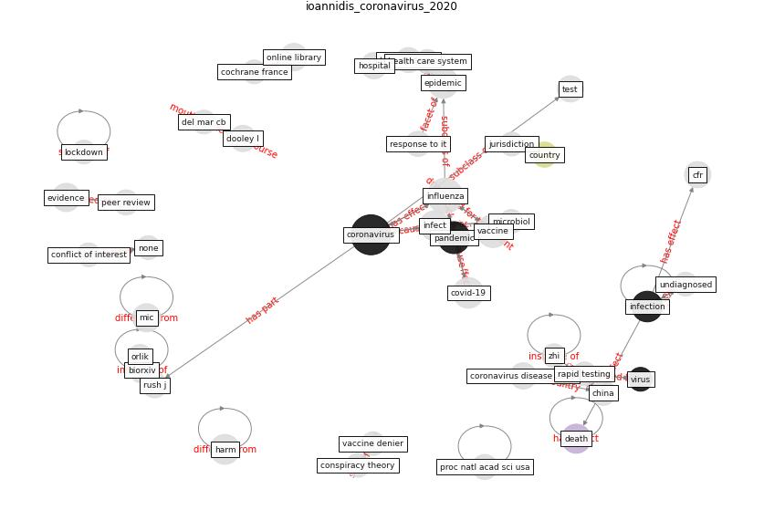

# Article: __Coronavirus disease 2019: The harms of exaggerated information and non‐evidence‐based measures__ (ioannidis_coronavirus_2020)

* [10.1111/eci.13222](https://doi.org/10.1111/eci.13222)
* Cluster: [health-ai](cluster_1)

## Keywords

[coronavirus](keyword_coronavirus), [influenza](keyword_influenza), [pandemic](keyword_pandemic), [epidemic](keyword_epidemic), [infection](keyword_infection), [infect](keyword_infect), [death](keyword_death), [hospital](keyword_hospital)

## Concepts

 

