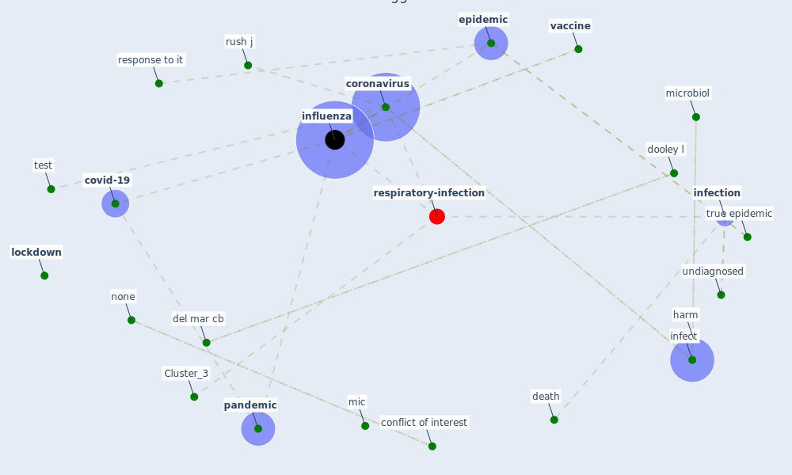

# Article: Coronavirus disease 2019: The harms of exaggerated information and non‐evidence‐based measures (ioannidis_coronavirus_2020)

* Source: [10.1111/eci.13222](https://doi.org/10.1111/eci.13222)
* Year: 2020
* Cluster: [health-city](cluster_1)

## Keywords

 * 8afaaf4, absence of evidence, bias, bloomberg, border closure, cfr, [china](keyword_china), [chinese](keyword_chinese), close contact, [cochrane france](keyword_cochrane_france), [conflict of interest](keyword_conflict_of_interest), conspiracy theory, [coronavirus](keyword_coronavirus), [coronavirus outbreak](keyword_coronavirus_outbreak), [country](keyword_country), cousin m, [covid-19](keyword_covid-19), current situation, [datum](keyword_datum), death, del mar cb, dispersion of weird inference, dooley l, [epidemic](keyword_epidemic), [evidence](keyword_evidence), face mask, gag, [germany](keyword_germany), glob health, hand hygiene, hand sanitizer, hand washing, [harm](keyword_harm), health worker, horror, [hospital](keyword_hospital), how, human coronavirus oc43, impulsive action, inappropriate, [infect](keyword_infect), [infection](keyword_infection), infection fatality rate, [influenza](keyword_influenza), intensive supportive care, j glob, jama, jamaica, jm z, jurisdiction, legislation, [lockdown](keyword_lockdown), mcgoogan, mic, [microbiol](keyword_microbiol), none, nonrandomize, oc43, [online library](keyword_online_library), orlik, orlik t, [outbreak](keyword_outbreak), [pandemic](keyword_pandemic), panic shopping, petric m, protein, [public health](keyword_public_health), rapid testing, respiratory illness, respiratory virus, response to it, routine endorsement, rush j, sars coronavirus, save many life, science, scientific information, sensationalism, sensitization, seriously ill, shortage of much need personnel, [south korea](keyword_south_korea), speculative, [spread](keyword_spread), spreeuwenberg, suppressive regime, [symptom](keyword_symptom), systematic review, [test](keyword_test), test kit, trial, true epidemic, uncertainty, undiagnosed, [vaccine](keyword_vaccine), vaccine denier, [virus](keyword_virus), wang q, weaponize, zhi

## Concepts

 

## Neighbours

### Closest articles

* Covid-19 and community mitigation strategies in a pandemic - [LINK](article_ebrahim_covid-19_2020)
* Overview of the mitigation strategies for COVID-19 pandemic - [LINK](article_ads_overview_2020)
* Response to COVID-19 in Taiwan - [LINK](article_wang_response_2020)
* Infodemic and the spread of fake news in the COVID-19-era - [LINK](article_orso_infodemic_2020)
* Coronavirus: Can artificial intelligence be smart enough to detect fake news? - [LINK](article_tong_coronavirus_2020)
*  - [LINK](article_mehtab_alam_role_2021)
* COVID-19: A new digital dawn? - [LINK](article_robbins_covid-19_2020)
* COVID-19 misinformation: Accuracy of articles about coronavirus prevention mostly shared on social media - [LINK](article_obiala_covid-19_2021)
* Telehealth overpromises during the Covid-19 pandemic - [LINK](article_ostherr_telehealth_2020)
* Management of the COVID-19 pandemic: challenges, practices, and organizational support - [LINK](article_hossny_management_2022)

### Closest BPs

* Blueprint: Resilience in staffing and skills training - [LINK](bp_12)
* Blueprint: Negative pressure rooms - [LINK](bp_13)
* Blueprint: Installing UV in ductwork - [LINK](bp_10)
