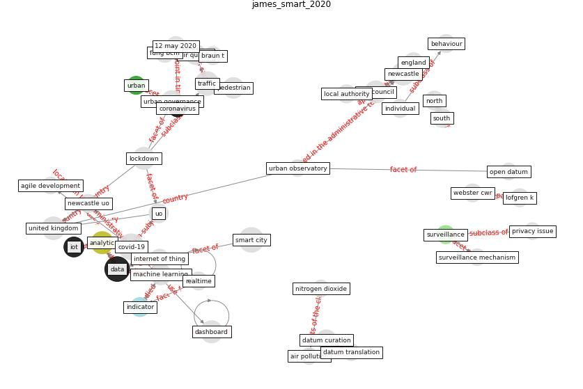

# Article: __Smart cities and a data-driven response to COVID-19__ (james_smart_2020)

* [10.1177/2043820620934211](https://doi.org/10.1177/2043820620934211)
* Cluster: [smart-datum](cluster_8)

## Keywords

* [covid-19](keyword_covid-19), [smart city](keyword_smart_city), [data](keyword_data), [traffic](keyword_traffic), [newcastle](keyword_newcastle), [united kingdom](keyword_united_kingdom), [city council](keyword_city_council), [analytic](keyword_analytic), [lockdown](keyword_lockdown), [dashboard](keyword_dashboard), [urban governance](keyword_urban_governance), [machine learning](keyword_machine_learning), pedestrian, air quality, [iot](keyword_iot)

## Keywords at large

* [biophilic design](keyword_biophilic_design), [architecture](keyword_architecture), [sustainable architecture](keyword_sustainable_architecture), [nature](keyword_nature), [design](keyword_design), [biophilic](keyword_biophilic), [environ](keyword_environ), [biophilia](keyword_biophilia), [wellbeing](keyword_wellbeing), [health](keyword_health)

## Abstract

This commentary describes the rapid development of a
COVID-19 data dashboard utilising existing Urban
Observatory Internet of Things (IoT) data and analytics
infrastructure. Existing data capture systems were rapidly
repurposed to provide real-time insights into the impacts
of lockdown policy on urban governance.

## Concepts

 

