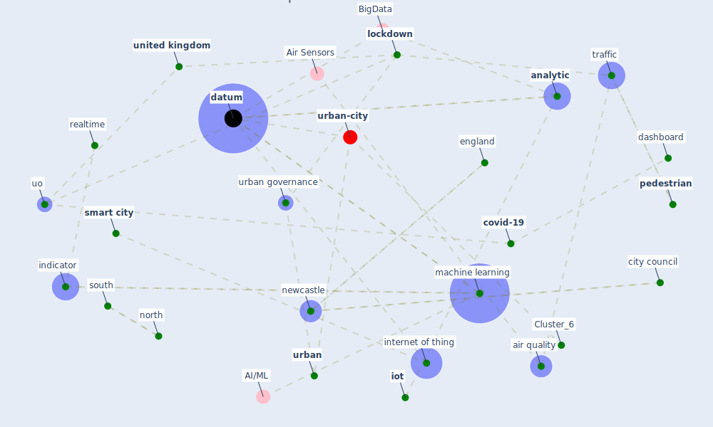

# Article: Smart cities and a data-driven response to COVID-19 (james_smart_2020)

* Source: [10.1177/2043820620934211](https://doi.org/10.1177/2043820620934211)
* Year: 2020
* Cluster: [urban-city](cluster_6)

## Keywords

 * agile development, [air pollution](keyword_air_pollution), air quality, albino v, [analysis](keyword_analysis), [analytic](keyword_analytic), anonymous open datum, api, application programming interface, behaviour, behaviour change, [big datum](keyword_big_datum), braun t, cause effect relationship, city centre, city council, collective, combine authority, communication barrier, [conflict of interest](keyword_conflict_of_interest), coronavirus resource centre, cousin pd and spekman r, [covid-19](keyword_covid-19), [crisis](keyword_crisis), dangelico rm, dashboard, [datum](keyword_datum), datum curation, datum point, datum translation, datum visualisation, dawson r, declaration of conflicting interest, downtown, downtown area, effect, england, fazey I, fung bcm, [government](keyword_government), harris n, health care facility, [indicator](keyword_indicator), individual, [internet of thing](keyword_internet_of_thing), [iot](keyword_iot), iot sensor, james p, johns hopkins university, knowledge exchange, lo fgren k, [lockdown](keyword_lockdown), lockdown policy, machine learning, [newcastle](keyword_newcastle), newcastle university, newcastle uo, nitrogen dioxide, north, north of tyne, open datum, ozone, pd, [pedestrian](keyword_pedestrian), [plan](keyword_plan), [privacy](keyword_privacy), privacy issue, public movement, purchase, realtime, [research](keyword_research), [researcher](keyword_researcher), [security](keyword_security), sense, show, [smart](keyword_smart), [smart city](keyword_smart_city), smart city datum, [society](keyword_society), south, spekman r, strategic response, stringer lc, supermarket, supply management, [surveillance](keyword_surveillance), surveillance mechanism, surveillance society, the lockdown continue, [traffic](keyword_traffic), uk government, [united kingdom](keyword_united_kingdom), uo, [urban](keyword_urban), [urban governance](keyword_urban_governance), urban landscape, urban observatory, urban science, visualisation, webster cwr

## Concepts

 

## Neighbours

### Closest articles

* Smart cities and the pandemic: digital technologies on the urban management of Brazilian cities - [LINK](article_fariniuk_smart_2020)
* On the Coronavirus (COVID-19) Outbreak and the Smart City Network: Universal Data Sharing Standards Coupled with Artificial Intelligence (AI) to Benefit Urban Health Monitoring and Management - [LINK](article_allam_coronavirus_2020)
* Learning from the COVID-19 pandemic in governing smart cities - [LINK](article_bolivar_learning_2022)
* Future (post-COVID) digital, smart and sustainable cities in the wake of 6G: Digital twins, immersive realities and new urban economies - [LINK](article_allam_future_2021)
* Pandemic stricken cities on lockdown. Where are our planning and design professionals [now, then and into the future]? - [LINK](article_allam_pandemic_2020)
* The three modes of existence of the pandemic smart city - [LINK](article_soderstrom_three_2021)
* Revisiting the built environment: 10 potential development changes and paradigm shifts due to COVID-19 - [LINK](article_cheshmehzangi_revisiting_2021)
* Contributions of Smart City Solutions and Technologies to Resilience against the COVID-19 Pandemic: A Literature Review - [LINK](article_sharifi_contributions_2021)
* The Smart City and Covid‐19 - [LINK](article_webb_smart_2020)
* The Emergence of Anti-Privacy and Control at the Nexus between the Concepts of Safe City and Smart City - [LINK](article_allam_emergence_2019)

### Closest BPs

* Blueprint: Smart Locker System - [LINK](bp_1)
* Blueprint: Mental health – Act: Do something - [LINK](bp_18)
* Blueprint: Mental health – Belong: Do something with someone - [LINK](bp_19)
