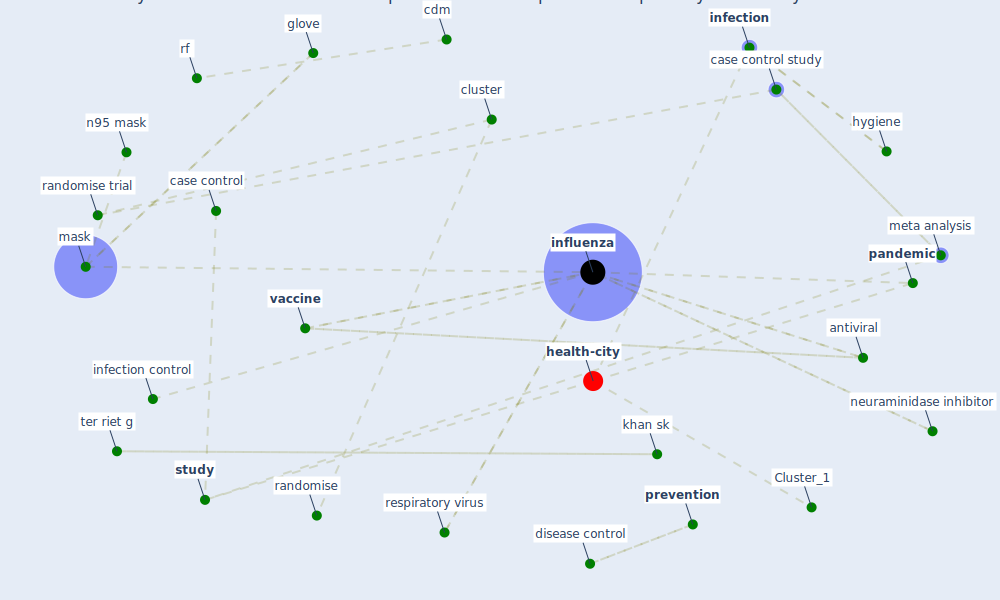

# Article: Physical interventions to interrupt or reduce the spread of respiratory viruses: systematic review (jefferson_physical_2008)

* Source: [10.1136/bmj.39393.510347.BE](https://doi.org/10.1136/bmj.39393.510347.BE)
* Year: 2008
* Cluster: [respiratory-infection](cluster_3)

## Keywords

 * acute respiratory infection, after study, alessandria, antiseptic, [antiviral](keyword_antiviral), blind, case control, case control study, cdm, cluster, cohort study, combination, conjugate vaccine, [coronavirus](keyword_coronavirus), datum extraction, day care, develop country, [disease](keyword_disease), disease control, effect measure, embase, [epidemic](keyword_epidemic), fever clinic, field form, flu, full paper, gastroenteritis, glanville j, glove, harnden ar, [health](keyword_health), heterogeneity, [hong kong](keyword_hong_kong), hygiene, inclusion criterion, inconsistency, industrialise country, [infection](keyword_infection), [infection control](keyword_infection_control), infectioncontrol, [influenza](keyword_influenza), influenza a, isolation, [italy](keyword_italy), khan sk, kleijnen j, language restriction, large pragmatic trial, larson el, [mask](keyword_mask), matheson nj, [meta analysis](keyword_meta_analysis), metaanalysis, n95 mask, neuraminidase inhibitor, non randomise, non randomise study, [pandemic](keyword_pandemic), pandemicflu, [pathogen](keyword_pathogen), phase 1 trial, phase 2 trial, phase 5, [prevention](keyword_prevention), prospective, purell, quarantine, randomisation, randomise, randomise control trial, randomise trial, reduce the spread, respiratory virus, rf, risk reduction, sar epidemic, severe acute respiratory syndrome, severe respiratory syndrome, soap, sowden aj, stage ii, standard deviation, standardised form, stroup df, studiesw1 w51, [study](keyword_study), study design, swingler g, [symptom](keyword_symptom), systematic review, teleman 2004w48, ter riet g, thompson sg, trial, [united states](keyword_united_states), [vaccine](keyword_vaccine), virucidal, wear gown, welch v, williamson gd

## Concepts

 

## Neighbours

### Closest articles

* COVID-19 Prevention and Control Measures in Workplace Settings: A Rapid Review and Meta-Analysis - [LINK](article_ingram_covid-19_2021)
* COVID-19: Risk assessment and mitigation measures in healthcare and non-healthcare workplaces - [LINK](article_fawzy_covid-19_2021)
* Contributions to the mitigation of the COVID-19 pandemic - [LINK](article_pilz_contributions_2022)
* COVID-19 and its Modes of Transmission - [LINK](article_karia_covid-19_2020)
* The effect of a redesigned floor plan, occupant density and the quality of indoor climate on the cost of space, productivity and sick leave in an office building–A case study - [LINK](article_saari_effect_2006)
* Current knowledge of COVID-19: Advances, challenges and future perspectives - [LINK](article_wu_current_2021)
* COVID-19 Pandemic: Prevention and Protection Measures to Be Adopted at the Workplace - [LINK](article_cirrincione_covid-19_2020)
* COVID-19 media fatigue: predictors of decreasing interest and avoidance of COVID-19–related news - [LINK](article_buneviciene_covid-19_2021)
* Characterization and performance evaluation of a full-scale activated carbon-based dynamic botanical air filtration system for improving indoor air quality - [LINK](article_wang_characterization_2011)
* The Effect of Opening Windows on Air Change Rates in Two Homes - [LINK](article_howard-reed_effect_2002)

### Closest BPs

* Blueprint: Negative pressure rooms - [LINK](bp_13)
* Blueprint: Installing high-efficiency air filters - [LINK](bp_11)
* Blueprint: Resilience in staffing and skills training - [LINK](bp_12)
