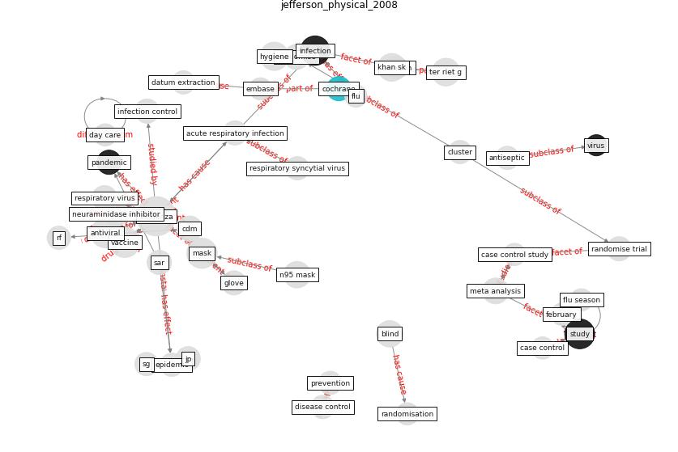

# Article: __Physical interventions to interrupt or reduce the spread of respiratory viruses: systematic review__ (jefferson_physical_2008)

* [10.1136/bmj.39393.510347.BE](https://doi.org/10.1136/bmj.39393.510347.BE)
* Cluster: [health-city](cluster_0.md)

## Keywords

[study](keyword_study.md), [antiviral](keyword_antiviral.md), [infection](keyword_infection.md)

## Concepts

 

