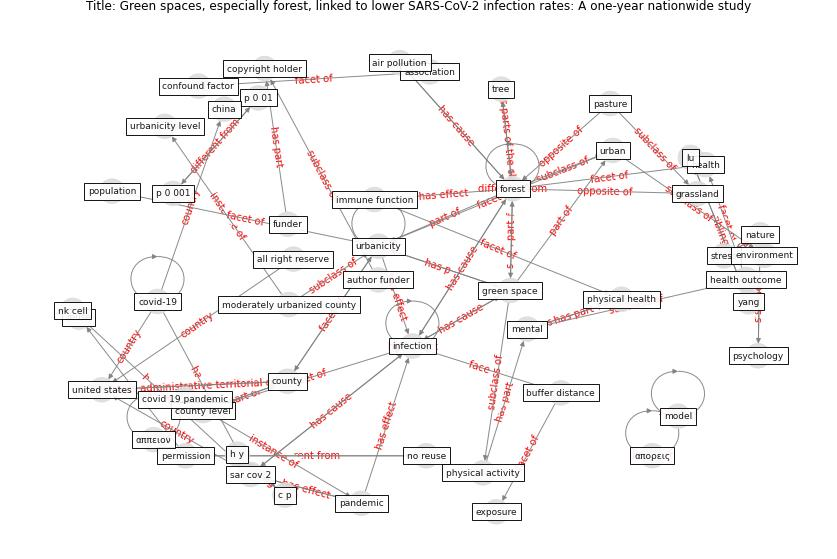

# Article: Green spaces, especially forest, linked to lower SARS-CoV-2 infection rates: A one-year nationwide study (jiang_green_2021)

* Source: [10.1101/2021.08.04.21261420](https://doi.org/10.1101/2021.08.04.21261420)
* Year: 2021
* Cluster: [city-health](cluster_14)

## Keywords

 * 50 km, [air pollution](keyword_air_pollution), all right reserve, [area](keyword_area), association, [austria](keyword_austria), [author funder](keyword_author_funder), buffer distance, c p, child, chile, [china](keyword_china), cohen s, commute, confound factor, contiguous united states, confidence, [copyright holder](keyword_copyright_holder), county, county level, [covid 19 pandemic](keyword_covid_19_pandemic), [covid-19](keyword_covid-19), [ecosystem](keyword_ecosystem), [environment](keyword_environment), esri, ethnicity, [exposure](keyword_exposure), [forest](keyword_forest), [funder](keyword_funder), gelormino e marra g ferracin e costa g, google earth engine, grassland, [green space](keyword_green_space), green space area, green space factor, h y, hay, [health](keyword_health), health outcome, immune function, [indoor](keyword_indoor), [infection](keyword_infection), infectionrate, interval, jiang b, land cover, lee, [limitation](keyword_limitation), line, lu, [mental](keyword_mental), [model](keyword_model), model 1, model 2, moderately urbanized county, [nature](keyword_nature), [network](keyword_network), [new york](keyword_new_york), [new york city](keyword_new_york_city), nk cell, no reuse, [obesity](keyword_obesity), p 0 001, p 0 01, [pandemic](keyword_pandemic), park, partial residual, pasture, [permission](keyword_permission), physical activity, [physical health](keyword_physical_health), [point](keyword_point), political, [population](keyword_population), pro, psychology, race, regression analysis, regression model, reuse, rural area, [sar cov 2](keyword_sar_cov_2), [social distancing](keyword_social_distancing), [stress](keyword_stress), sun, tree, [u k](keyword_u_k), [united states](keyword_united_states), [urban](keyword_urban), [urban area](keyword_urban_area), urbanicity, urbanicity level, usafact, xml, yang, yu, ywy, αpeperous, απορεις, αππειον

## Concepts

 

## Neighbours

### Closest articles

* Green in times of COVID-19: urban green space relevance during the COVID-19 pandemic in Buenos Aires City - [LINK](article_marconi_green_2022)
* Effects of the COVID-19 pandemic on the use and perceptions of urban green space: An international exploratory study - [LINK](article_ugolini_effects_2020)
* The role of green roofs in post COVID-19 confinement: An analysis of willingness to pay - [LINK](article_manso_role_2021)
* The impact of the COVID-19 pandemic on the importance of urban green spaces to the public - [LINK](article_noszczyk_impact_2022)
* Urban form: Realising the value of green space: a planners’ perspective on the COVID-19 pandemic - [LINK](article_ahmadpoor_urban_2021)
* Green infrastructure through the lens of “One Health”: A systematic review and integrative framework uncovering synergies and trade-offs between mental health and wildlife support in cities - [LINK](article_felappi_green_2020)
* Association between indoor-outdoor green features and psychological health during the COVID-19 lockdown in Italy: A cross-sectional nationwide study - [LINK](article_spano_association_2021)
* Urban Green Infrastructure and Green Open Spaces: An Issue of Social Fairness in Times of COVID-19 Crisis - [LINK](article_reinwald_urban_2021)
* Urban design attributes and resilience: COVID-19 evidence from New York City - [LINK](article_yang_urban_2021)
* Urban Community Sustainable Development Patterns under the Influence of COVID-19: A Case Study Based on the Non-Contact Interaction Perspective of Hangzhou City - [LINK](article_wang_urban_2021)

### Closest BPs

* Blueprint: Architecture design - [LINK](bp_2)
* Blueprint: Public places as information points - [LINK](bp_8)
* Blueprint: Tender support at building stage - [LINK](bp_9)
