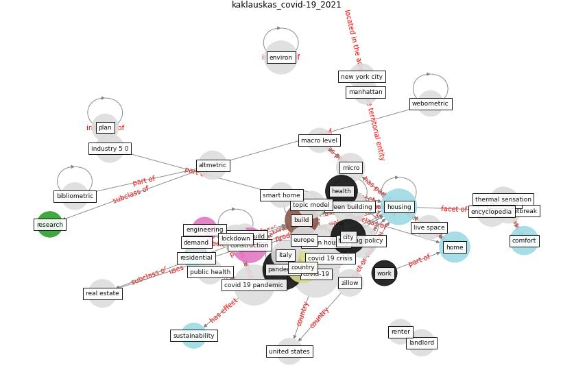

# Article: COVID-19 and Green Housing: A Review of Relevant Literature (kaklauskas_covid-19_2021)

* Source: [10.3390/en14082072](https://doi.org/10.3390/en14082072)
* Year: 2021
* Cluster: [building-space](cluster_1)

## Keywords

 * [air pollution](keyword_air_pollution), altmetric, [amenity](keyword_amenity), [architecture](keyword_architecture), bathroom, bibliometric, bidet, bike, biome, [build](keyword_build), [build environment](keyword_build_environment), [building](keyword_building), [city](keyword_city), civil engineering, co2 emission, [comfort](keyword_comfort), [construction](keyword_construction), [construction industry](keyword_construction_industry), [coronavirus](keyword_coronavirus), [country](keyword_country), [covid 19 crisis](keyword_covid_19_crisis), covid 19 outbreak, [covid 19 pandemic](keyword_covid_19_pandemic), [covid-19](keyword_covid-19), d alessandro, demand, [design](keyword_design), energy build, [energy consumption](keyword_energy_consumption), [engineering](keyword_engineering), entertainment, [environment](keyword_environment), [environmental](keyword_environmental), [europe](keyword_europe), [government](keyword_government), [green building](keyword_green_building), [green housing](keyword_green_housing), [health](keyword_health), history of idea, [home](keyword_home), [housing](keyword_housing), housing market, housing policy, houston, [indoor environment](keyword_indoor_environment), industry 4 0, industry 5 0, [infection](keyword_infection), [internet of thing](keyword_internet_of_thing), iran, [italy](keyword_italy), [landlord](keyword_landlord), life cycle, live space, [lockdown](keyword_lockdown), [london](keyword_london), macro level, [manhattan](keyword_manhattan), metric, micro, mohammadian, mortgage, national, [need](keyword_need), [new york](keyword_new_york), [new york city](keyword_new_york_city), [occupant health](keyword_occupant_health), [pandemic](keyword_pandemic), [plan](keyword_plan), [poland](keyword_poland), [policy](keyword_policy), [public health](keyword_public_health), publication, [remote work](keyword_remote_work), renter, [research](keyword_research), [room](keyword_room), science, scientific literature, scientometric, smart home, [social](keyword_social), suburb, [sustainability](keyword_sustainability), [sustainable](keyword_sustainable), sustainable building, [sustainable development](keyword_sustainable_development), taraborelli, topic model, transit, uncertainty, [united states](keyword_united_states), [urban](keyword_urban), webometric, [well be](keyword_well_be), [wellbee](keyword_wellbee), [work](keyword_work), work from home, work site, zillow

## Concepts

 

## Neighbours

### Closest articles

* Towards Resilient Residential Buildings and Neighborhoods in Light of COVID-19 Pandemic—The Scenario of Podgorica, Montenegro - [LINK](article_bojovic_towards_2022)
* Prophylactic Architecture: Formulating the Concept of Pandemic-Resilient Homes - [LINK](article_elrayies_prophylactic_2022)
*  - [LINK](article_dalessandro_covid-19_2020)
* How our homes impact our health: using a COVID-19 informed approach to examine urban apartment housing - [LINK](article_peters_how_2020)
* How is COVID-19 Experience Transforming Sustainability Requirements of Residential Buildings? A Review - [LINK](article_tokazhanov_how_2020)
* RESIDENTIAL ARCHITECTURE IN A POST-PANDEMIC WORLD: IMPLICATIONS OF COVID-19 FOR NEW CONSTRUCTION AND FOR ADAPTING HERITAGE BUILDINGS - [LINK](article_spennemann_residential_2021)
* Adaptive Design of the Built Environment to Mitigate the Transmission Risk of COVID-19 - [LINK](article_ara_dilshad_shangi_adaptive_2020)
* Designing for COVID-2x: Reflecting on Future-Proofing Human Habitation for the Inevitable Next Pandemic - [LINK](article_spennemann_designing_2022)
* Houses amid COVID-19: Environmental challenges and design adaptation - [LINK](article_hizra_houses_2021)
* How Architecture Fails in Conditions of Crisis: a Discussion on the Value of Interior Design over the COVID-19 Outbreak - [LINK](article_rassia_how_2020)

### Closest BPs

* Blueprint: Architecture design - [LINK](bp_2)
* Blueprint: Mental health – Act: Do something - [LINK](bp_18)
* Blueprint: Building Adaptation during a pandemic - [LINK](bp_14)
